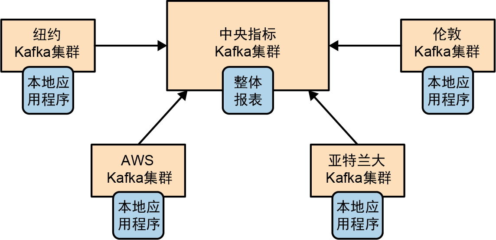

### 第1章 初识Kafka
### 第2章 安装Kafka
### 第3章 Kafka生产者（向Kafka写入数据）
### 第4章 Kafka消费者（从Kafka读取数据）
### 第5章 编程式管理Kafka
### 第6章 深入Kafka
### 第7章 可靠的数据传递
### 第8章 精确一次性语义
### 第9章 构建数据管道
### 第10章 跨集群数据镜像
### 第11章 保护Kafka
### 第12章 管理Kafka
### 第13章 监控Kafka
### 第14章 流式处理


### 第1章 初识Kafka

**发布与订阅消息系统**
* 消息的发送者（发布者）：不直接把消息发送给接收者，而是对消息进行分类
* 消息的接收者（订阅者）：通过订阅它们来接收特定类型的消息
* broker：发布消息的地方

**消息系统痛点**
* 需要单一的集中式系统，而不是多个数据队列维护不同系统
* 发布通用的数据
* 规模随业务增长而增长

**Kafka**
* 分布式日志平台（性能伸缩）
* 持久化保存
* 按需读取
* 保存事务：文件系统 / 数据库提交日志
* 重放日志：重建系统状态（故障恢复）

**消息**
* Kafka数据单元（可以看作一个数据行或一条记录）
* 由字节数组组成
* 消息键：可选的元数据
* 分区：为键生成一致性哈希值，用于对主题分区数取模，为消息选取分区
* 保证具有相同键的消息总是会被写到相同的分区中（前提是分区数量没有变化）

**批次**
* 一组属于同一个主题和分区的消息
* 消息被分批写入Kafka
* 需要在延迟和吞吐之间权衡，批次越大，单条消息传输时间越长

**消息模式**
* JSON
* XML
* Apache Avro（序列化框架）

**数据格式的一致性**
* 消除消息读写操作之间的耦合性
* 避免订阅者需要升级之后才能处理新消息格式，发布者在订阅者升级之后跟着升级

**主题**
* 主题：消息通过主题进行分类
* 分区：主题被分为若干个分区，一个分区一个提交日志
* 消息：消息通过追加的方式写入分区，按照先进先出的顺序读取
* 顺序：只能保证单个分区内消息有序，无法保证主题范围内消息有序

**生产者**
* 创建消息
* 把消息均衡地分布到主题的所有分区中，或通过消息键和分区器将消息写入指定分区

**消费者**
* 读取消息
* 订阅一个或多个主题，并按照消息写入分区的顺序读取它们
* 通过检查消息的偏移量来区分已经读取过的消息

**偏移量**
* 不断递增的整数值
* 元数据，创建消息时会添加到消息里
* 每条消息的偏移量唯一，越往后偏移量越大，但不一定严格单调递增
* 意义：保存消息的读取状态，用于故障恢复

**消费者群组**
* 属于同一群组的一个或多个消费者，共同读取同一个主题
* 群组可以保证每个分区只被这个群组的一个消费者读取
* 如果一个消费者失效，群组里的其他消费者可以接管失效消费者的工作
* 消费者与分区之间的映射称为消费者对分区的所有权关系


**broker**
* 一台单独的kafka服务器
* 响应生产者：接收来自生产者的消息，为其设置偏移量，并提交到磁盘保存
* 响应消费者：对读取分区的请求做出响应，并返回一级钢发布的消息
* 可以轻松处理数千个分区和每秒百万级的消息量

**集群**
* 集群：由多个broker组成
* 集群控制器：负责为broker分配分区和监控broker，自动从活动的集群成员broker中选举

**分区**
* 分区首领：一个分区从属于一个broker
* 分区跟随者：分区副本被分配给跟随broker，从分区首领处复制数据，与首领保持同步
* 分区复制：分区的消息冗余，如果首领broker发生故障，其中一个跟随broker可以接管它的领导权
* 发布消息：发布消息的生产者必须连接到首领
* 读取消息：消费者可以从首领或者跟随者那里读取消息

**同步副本**
* 分区的首领肯定是同步副本
* 跟随者副本满足以下条件才被认为是同步副本
  保持活跃会话（最近向ZooKeeper发送过心跳）
  最近从首领副本处复制过最新消息

**不同步副本**
* 稍有滞后的同步副本，会导致生产者和消费者变慢
* 如果一个副本变成不同步副本，就不再关心它是否已经收到消息（不影响性能）意味着更小的有效复制系数，停机时丢失数据的风险更大


**消息保留策略**
* 策略一：保留一段时间（如7天）
* 策略二：保留消息总量达到一定的字节数（如1GB）
* 紧凑型日志：只有最后一条带有特定键的消息会被保留，适用于变更日志类型的数据（只关心最近一次发生的更新事件）
* 当消息数量达到上限时，旧消息过期并被删除

**多集群**
* 随着broker数量增加
* 数据类型分离
* 安全需求隔离
* 多数据中心（灾难恢复）

**Kafka优势**
* 支持多个生产者
* 支持多个消费者
* 基于磁盘的数据保留
* 伸缩性
* 高性能

**多个生产者**
* 适合从多个前端系统收集数据，并以统一的格式对外提供数据
* 不需要协调不同生产者的数据流，所有服务都以相同的消息格式向同一主题写入数据

**多个消费者**
* 不同群组的消费者可以读取同一消息流的数据，消费者之间互不影响
* 同一群组的消费者共享消息流，保证整个群组只处理一次给定的消息

**基于磁盘的数据保留（持久化）**
* 支持消费者非实时地读取消息，消费者可以暂时离线，不用担心消息阻塞
* 消费者重启后可以从上次中断的地方继续处理消息，保证数据不会丢失
* 每个主题可以设置单独的保留策略，以满足不同消费者的需求

**伸缩性**
* 对在线集群进行扩展不影响系统的整体可用性
* 包含多个broker的集群，即使一个broker失效，仍然可以持续提供服务

**高性能**
* 横向拓展生产者、消费者和broker

**数据生态系统**
* 接口：Kafka在各个组件之间传递消息，为所有客户端提供一致的接口
* 耦合：生产者和消费者不再紧密耦合，不需要在它们之间建立直连
* 增减：根据业务需要添加或移除组件，生产者不再关心谁使用数据，也不关心几个消费者


**Kafka集群**


> **本章总结**
> * 主题1->分区N->同一群组的消费者N->消息NN


### 第3章 Kafka生产者（向Kafka写入数据）


**向Kafka发送消息的步骤**
* 创建对象：目标主题、内容、键、分区、时间戳或标头（键和值需序列化成字节数组来进行传输）
* 分区：没有显示指定分区，分区器基于键来选择分区
* 批次：消息被添加到消息批次，批次内的所有消息都被发送给同一个主题和分区（目标broker）
* 响应：broker收到消息后进行响应，消息写入成功返回对象，消息写入失败则返回错误
* 重试：生产者收到错误后会尝试重新发送消息，重试后如果还是失败，停止重试并返回错误

**生产者必选属性（向Kafka写入消息）**
* `bootstrap.servers`：broker地址，生产者连接到集群，不需要包含全部broker，可以从给定的broker找到其他broker的信息，建议提供两个
* `key.serializer`：类名，用来序列化消息的键（对象->字节数组）
* `value.serializer`：类名，用来序列化消息的值（字节数组->对象）

**生产者可选属性**
* `client.id`：客户端标识符，可以用在日志、指标和配额中，方便排查问题
* `acks`：生产者在多少个分区副本收到消息后，认为消息写入成功

**acks**
* `acks=0`：生产者不会等待任何来自broker的响应（以最大速率发送消息，吞吐很高）
* `acks=1`：只要集群的首领副本收到消息，生产者就会收到消息写入成功的响应
* `acks=all`：当所有副本全部收到消息时，生产者才会收到消息写入成功的响应
* 可靠性和低延迟的取舍，牺牲可靠性来换取较低的生产者延迟

```
// 创建生产者
Properties props = new Properties();
props.put("bootstrap.servers", "broker1:9092,broker2:9092");  // brokder地址
props.put("key.serializer", "org.apache.kafka.common.serializetion.StringSerializer");  // 键序列化器
props.put("value.serializer", "org.apache.kafka.common.serializetion.StringSerializer");  // 值序列化器
KafkaProducer<String, String> producer = new KafkaProducer<String, String>(props);  // 生产者
```

**消息发送方式**
* 发送并忘记：把消息发送给服务器，但并不关心它是否成功送达（不会收到返回的任何信息或异常）
* 同步发送：等待消息发送成功，再发送下一条消息
* 异步发送：指定回调函数，当服务器返回响应时，会触发回调函数

**回调函数**
* 回调的操作在生产者主线程中进行
* 回调的顺序按照发送的顺序执行
* 回调的执行要快，避免生产者出现延迟或影响其他消息发送
* 不建议在回调中执行阻塞操作，应在其他线程中执行

```
// 消息对象：主题+键+值
ProducerRecord<String, String> record = new ProducerRecord<>("topic", "key", "value");
try {
  producer.send(record);  // 发送消息
  producer.send(record).get();  // 同步发送消息
  producer.send(record, new DemoProducerCallback());  // 异步发送消息
} catch (Exception e) {
  e.printStackTrace();
}

// 回调函数
private class DemoProducerCallback implements Callback {
  @override
  public void onCompletion(RecordMetadata recordMetadata, Exception e) {
    if (e != null) {
      e.printStackTrace();
    }
  }
}
```

---

**自定义序列化器**

```
// 自定义客户类
public class Customer {
  private int customerId;
  private String customerName;
  public Customer(int ID, String name) {
    this.customerId = ID;
    this.customerName = name;
  }
  public int getID() { return customerId; }
  public int getName() { return customerName; }
}

// 为这个类创建一个序列化器
import org.apache.kafka.common.errors.SerializationException;
import java.nio.ByteBuffer;
import java.util.Map;

public class CustomerSerializer implements Serializer<Customer> {
  @override
  public void configure(Map configs, boolean isKey) {}  // 不需要配置
  @override
  public void close() {}  // 不需要关闭
  @override
  public byte[] serialize(String topic, Customer data) {
    try {
      byte[] serializedName;
      int stringSize;
      if (data == null) {
        return null;
      } else {
        if (data.getName() != null) {
          serializedName = data.getName().getBytes("UTF-8");  // 将字符转化为字节
          stringSize = serializedName.length;
        } else {
          serializedName = new byte[0];
          stringSize = 0;
        }
      }
      ByteBuffer buffer = ByteBuffer.allocate(4 + 4 + stringSize);
      buffer.putInt(data.getID());  // length=4
      buffer.putInt(stringSize);    // length=4
      buffer.put(serializedName);   // length=stringSize
      return buffer.array();        // 返回序列化后的结果
    } catch (Exception e) {
      throw new SerializationException("Error when serializing Customer to byte[]" + e);
    }
  }
}
```

**Avro序列化器**
* 定义Avro数据：与语言无关的模式
* 描述Avro数据：用JSON描述模式
* 新模式：生产者使用了新模式，消费者可以继续处理消息，而无需做任何修改


```
// 模式
{
  "namespace": "customerManagement.avro",
  "type": "record",
  "name": "Customer",
  "fields": [  // 定义每个字段的名称和字段类型，是否有默认值
    {"name": "id", "type": "int"},
    {"name": "name", "type": "string"},
    // 新字段和旧字段都是可选的，兼容新模式与老模式，消费者无需修改
    // 可选字段，旧模式
    {"name": "faxNumber", "type": ["null", "string"], "default": "null"},
    // 可选字段，新模式
    {"name": "email", "type": ["null", "string"], "default": "null"}
  ]
}

// 发送消息
Properties props = new Properties();
props.put("bootstrap.servers", "localhost:9092");
props.put("key.serializer", "io.confluent.kafka.serializers.KafkaAvroSerializer");
props.put("value.serializer", "io.confluent.kafka.serializers.KafkaAvroSerializer");
Producer<String, Customer> producer = new KafkaProducer<>(props);  // 生产者

String topic = "customerContacts";  // 发送消息时才需要指定主题
while (true) {
  Customer customer = CustomerGenerator.getNext();
  System.out.println("Generated customer " + customer.toString());
  ProducerRecord<String, Customer> record = new ProducerRecord<>(topic, customer.getName, customer);  // 消息记录，键为客户名称，值为customer类对象
  producer.send(record);
}
```

**默认分区器**
* 键为空
  消息随机发送给主题的分区，以批次为单位写入
  分区器使用轮询调度算法，均匀分配消息到各个分区
* 键不为空
  对键进行哈希，根据哈希值把消息映射到特定分区
  分区数量不变的情况下，同一个键总是被映射到同一个分区，哪怕这个分区不可用

**自定义分区器**
* 避免因为消息键数量不均，导致分区出现存储空间不足、请求缓慢等问题

```
// 创建包含键和值的记录
ProducerRecord<String, String> record = new ProducerRecord<>("topic", "key", "value");

// 创建键为空的记录，不指定键就行了
ProducerRecord<String, String> record = new ProducerRecord<>("topic", "value");

// 自定义分区器
import org.apache.kafka.clients.producer.Partitioner;
import org.apache.kafka.common.Cluster;
import org.apache.kafka.common.PartitionInfo;
import org.apache.kafka.common.record.InvalidRecordException;
import org.apache.kafka.common.utils.Utils;

public class BananaPartitioner implements partitioner {
  public void Configure(Map<String, ?> configs) {}
  public int partition(String topic, Object key, byte[] keyBytes,
                       Object value, byte[] valueBytes, Cluster cluster) {
    List<PartitionInfo> partitions = cluster.partitionsForTopic(topic);
    int numPartitions = partitions.size();
    if ((keyBytes == null) || (!key instanceOf String)) {
      throw new InvalidRecordException("We except all messages to have customer name as key");
    }
    if (((String) key).equals("Banana")) {
      // Banana的记录比其他键值都多，总是被分配到最后一个分区
      return numPartitions - 1;
    }
    // 其他记录被哈希到其他分区
    return Math.abs(Utils.murmur2(keyBytes)) % (numPartitions - 1)
  }
  public void close() {}
}
```

**生产者发送速率与broker处理能力（异步调用情况下）**
* 发送速率超过broker接收速率：消息会被放入客户端的内存缓冲区，缓冲区耗尽，阻塞后续的消息发送
* 超时：超时延迟不足以让broker赶上生产者，缓冲区清理不完，抛出超时异常
* 超时：批次里的记录因为等待时间超过超时时间而过期，抛出超时异常
* 监控：确保broker处理能力总是与生产者发送数据的速率相匹配


### 第4章 Kafka消费者（从Kafka读取数据）


**消费者和消费者群组**
* 就像多个生产者可以向相同主题写入消息，多个消费者也可以从同一个主题读取消息
* 消费者从属于消费者群组，同一群组订阅同一个主题，不同群组可以重复订阅主题
* 群组里每个消费者负责读取主题的部分消息（一个或多个分区），所有消费者共享主题分区所有权
* 消费者数量超过分区数量，有消费者空闲
* 横向伸缩消费者：单个应用读取消息，增减群组内的消费者
* 横向伸缩消费者群组：多个应用读取消息，增减群组

**消费者群组和分区再均衡**
* 共享：群组内所有消费者共享主题分区所有权
* 接管：一个消费者被关闭或发生异常，它将离开群组，它的分区由群组内其他消费者接管
* 重分配：主题发生变化（如添加新分区）会导致分区重分配
* 再均衡：分区所有权从一个消费者转移到另一个消费者

**再均衡**
* 主动再均衡
* 协作再均衡

**主动再均衡**
* 所有消费者接到通知，停止读取消息，放弃分区所有权
* 重新加入群组，并获得重新分配后的分区


**协作再均衡（增量再均衡）**
* 消费者群组首领通知部分消费者，将失去部分分区所有权，停止读取分区
* 消费者群组首领将这些没有所有权的分区分配给其他消费者
* 其他消费者继续读取原来的分区
* 可能需要进行几次迭代，直到达到稳定状态，但是避免了主动再均衡会出现的停顿


**心跳**
* 消费者会向群组协调器broker发送心跳
* 保持群组成员关系和对分区的所有权关系

**群组协调器认为消费者已经死亡，触发再均衡**
* 会话超时：消费者在一段时间内没有发送心跳
* 发生崩溃：消费者发生崩溃并停止读取消息

**分区分配过程**
* 消费者向群组协调器发送请求，加入消费者群组，第一个加入群组的消费者成为群组首领
* 首领从群组协调器获取群组成员列表（活着的成员），并为每一个消费者分配分区
* 分区分配完毕，首领把分区分配信息发送给群组协调器，群组协调器再发送给所有消费者
* 每个消费者只能看到自己的分配信息，只有首领会持有所有消费者及其分区所有权信息

**群组成员**
* 默认情况下，消费者群组的成员都是临时的
* 消费者离开群组，分区所有权会被撤销
* 该消费者重新加入时，会分配新的成员ID和新分区（再均衡）

**群组固定成员**
* 给消费者分配唯一的成员ID`group.instance.id`，让它成为群组的固定成员
* 消费者被关闭时，它不会自动离开群组，仍然是群组成员，直到会话超时
* 该消费者重新加入群组时，会继续持有之前的身份，并分配到之前所持有的分区（不会触发再均衡）

**默认分区分配策略**
* 区间：将主题的若干个连续分区分配给消费者
* 轮询：将主题的所有分区按顺序逐个分配给消费者
* 黏性：初始分配分区保持均衡，重新分配后同样保持均衡，减少需要移动的分区数量
* 协作黏性：协作（增量式）再均衡

```
// 创建消费者
Properties props = new Properties();
props.put("bootstrap.servers", "broker1:9092,broker2:9092");  // brokder地址
props.put("group.id", "CountryCounter");  // 消费者群组
props.put("key.deserializer", "org.apache.kafka.common.serializetion.StringSerializer");  // 键反序列化器
props.put("value.deserializer", "org.apache.kafka.common.serializetion.StringSerializer");  // 值反序列化器
KafkaConsumer<String, String> consumer = new KafkaConsumer<String, String>(props);  // 消费者

// 订阅主题：接收主题列表（一个或多个主题）或传入正则表达式
// 如果传入正则表达式，当符合条件的新主题出现时，会立即触发一次再均衡，然后消费者就可以读取新主题的消息
consumer.subscribe(Collections.singletonList("consumerCountries"));  // 订阅一个主题
consumer.subscribe(Pattern.compile("text.*"));  // 订阅多个主题
```

**偏移量提交**
* 更新分区当前读取位置（实际提交的偏移量为当前读取位置+1）
* 不会提交每一条记录，而是将已成功处理的最后一条消息提交，并假定之前的所有消息都成功处理
* 如果发生故障或发生再均衡，恢复后消费者会从偏移量位置开始读取

**重复处理消息/丢失消息**
* 再均衡完成之后，消费者可能会被分配新的分区
* 为了继续之前的工作，需要读取每个分区最后一次提交的偏移量，从偏移量位置继续读取
* 最后一次提交的偏移量小于客户端处理的最后一条消息偏移量，之间的消息会被重复处理
* 最后一次提交的偏移量大于客户端处理的最后一条消息偏移量，之间的消息会丢失


**自动提交偏移量**
* 按照设置的提交间隔，自动提交poll方法返回的最大偏移量
* 在轮询循环中自动提交，调用poll方法时需要确保上一次返回的所有消息都已被处理完毕

**同步提交偏移量**
* 同步：等偏移量提交完成，再接着轮询消息
* 重试：会持续重试

**异步提交偏移量**
* 异步：不等偏移量提交完成就接着处理消息
* 不会重试：可能已经有一个更大的偏移量提交成功，即使这次不成功下一次也会成功
* 提交顺序：如果先提交小偏移量但不成功，后提交大偏移量，再重新提交小偏移量，这时候如果发生再均衡，就会导致消息重复
* 维护顺序：单调递增的序列号变量，每次异步提交后更新变量，提交前先比较变量与当前偏移量大小
* 回调函数：会在broker返回响应时执行，可以用来重试提交偏移量，但要注意提交顺序

**同步和异步组合提交**
* 偶然提交失败不会有太大问题，后续的提交总会成功
* 但如果是发生在消费者被关闭或再均衡前的最后一次提交，就要确保提交成功

**在批次处理过程中提交偏移量**
* 提交时传入想要提交的分区和偏移量
* 需要跟踪所有分区的偏移量

```
// 轮询向服务器请求数据
Duration timeout = Duration.ofMillis(100);
while (true) {
  // 1、持续请求读取数据（该方法会自动提交偏移量），传入超时时间（阻塞间隔）
  ConsumerRecords<String, String> records = consumer.poll(timeout);  // 一批消息
  // 避免在轮询循环中做任何可能导致不可预知的阻塞的操作
  for (ConsumerRecords<String, String> record : records) {
    System.out.printf("topic = %s, partition = %d, offset = %d, consumer = %s, country = %s\n",
                      record.topic(), record.partition(), record.offset(), record.key(), record.value());
    int updatedCount = 1;
    if (custCountryMap.containsKey(record.value())) {
      updatedCount = custCountryMap.get(record.value()) + 1;
    }
    custCountryMap.put(record.value(), updatedCount);  // 值一共出现几次
    JSONObject json = new JSONObject(custCountryMap);
    System.out.println(json.toString());  // 假定到这一步就将消息处理完毕
  }

  // 2、同步提交偏移量：在轮询更多的消息之前，提交当前批次最新的偏移量，会持续重试
  try {
    consumer.commitSync(); 
  } catch {
    log.error("commit failed", e);
  }

  // 3、异步提交偏移量：提交最后一个偏移量，然后继续处理，不会重试（支持回调函数）
  consumer.commitAsync(
    new offsetCommitCallback() {
      public void conComplete(Map<TopicPartition, OffsetAndMetadata> offsets, Exception e) {
        if (e != null) {
          log.error("commit failed for offserts {}", offsets, e);
        }
      }
    }
  );
}

// 4、同步与异步组合提交偏移量
try {
  while (!closing) {
    for (...) {}
    consumer.commitAsync();  // 一切正常，异步提交偏移量，一次不成功还有下一次
  }
  consumer.commitSync();  // 如果直接关闭消费者，就没有下一次提交了，要同步提交
} catch (Exception e) {
  log.error("Unexpected error", e);
} finally {
  consumer.close();
}

// 5、在批次处理过程中提交偏移量
private Map<TopicPartition, OffsetAndMetadata> currentOffsets = new HashMap<>();  // 用于跟踪偏移量的map
int count = 0;
while (true) {
  for (...) {
    ...
    currentOffsets.put(
      new TopicPartition(record.topic(), record.partition),
      new OffsetAndMetadata(record.offset()+1, "no metadata"));
    if (count % 1000 == 0) {  // 每1000条记录提交一次
      consumer.commitAsync(currentOffsets, null);  // 没有回调函数
    }
    count++;
  }
}
```

---

**再均衡监听器**
* 消费者在退出和进行分区再均衡之前做一些清理工作
* 失去旧分区：提交最后一个已处理记录的偏移量，关闭文件句柄、数据库连接等
* 分配新分区：加载分区状态信息，找到最新的偏移量

**从指定偏移量位置读取记录**
* poll函数从各个分区的最新偏移量位置读取消息
* 可以让poll函数从不同的位置读取消息，例如分区起始位置、分区末尾、特定位置

---

**独立消费者（不属于任何群组）**
* 消费者群组：分区会被自动分配给消费者，群组增减消费者会自动触发再均衡
* 独立消费者：不需要订阅主题，直接将目标分区分配给消费者（订阅主题需加入群组）
* 不会发生再均衡，不需要手动查找分区，但是如果主题增加了新分区，消费者不会收到通知

```
List<PartitionInfo> partitionInfos = null;
partitionInfos = consumer.partitionsFor("topic");  // 向主题请求可用分区（可省略）

if (partitionInfos != null) {
  for (PartitionInfo partition : partitionInfos) {
    partitions.add(new TopicPartition(partition.topic(), partition.partition()));
  }
  consumer.assign(partitions);  // 为消费者注册想要读取的分区
  while (true) {...}  // 处理消息和提交偏移量
}
```


### 第5章 编程式管理Kafka

**高级管理操作**
* 为主题添加分区
* 从主题中删除消息
* 首领选举：首选首领选举、不彻底的首领选举
* 重新分配副本：broker过载或关闭broker

**首选首领选举**
* 每一个分区都有一个可以被指定为首选首领的副本
* 如果所有分区的首领都是它们的首选首领副本，每个broker上的首领数量应该是均衡的
* 定期检查首领是否就是首选首领副本，如果不是但它有资格成为首领，就会选择它为首领

**不彻底的首领选举**
* 一个分区的首领副本变得不可用，而其他副本没有资格成为首领（通常因为缺少数据）
* 这个分区没有首领，也就不可用了
* 此时可以选举一个本没有资格成为首领的副本作为首领


### 第6章 深入Kafka

**ZooKeeper**
* 维护Kafka集群的成员信息
* broker注册ID，创建临时节点
* broker关闭，移除临时节点

**控制器**
* broker，除提供一般功能，还负责选举分区首领
* 集群中第一个启动的broker会成为控制器
* 如果控制器被关闭，集群中的其他broker收到通知，并尝试成为新的控制器
* 旧控制器不知道已经选出了新的控制器，持续发送消息，被认为是僵尸控制器（脑裂）
* 控制器从ZooKeeper中加载最新的副本集状态，然后开始管理集群元数据和执行首领选举
* broker离开集群，位于它上面的所有分区需要一个新首领，控制器负责选出新首领
* 控制器向ZooKeeper发送新首领和跟随者的信息（成员关系）

**副本类型**
* 首领副本
* 跟随者副本

**首领副本**
* 每个分区都有一个首领副本
* 所有生产者请求和消费者请求都会经过这个副本
* 如果手动重新分配副本，第一个指定的副本就是首选首领
* 要确保首选首领被分配给不同的broker，避免单个broker负载过重

**跟随者副本**
* 首领以外的副本，负责从首领副本复制消息，保持与首领一致的状态
* 当首领崩溃时，其中一个跟随者会被提拔成新副本

**向broker发送的请求**
* 生产请求
* 读取请求
* 管理请求
* 元数据请求

**生产请求**
* 发送人：生产者
* 请求对象：发送给分区首领broker
* 请求内容：客户端要向broker写入的消息
* 响应：消息先被写入分区首领（再复制到跟随者副本）将响应返回给客户端

**读取请求**
* 发送人：消费者和跟随者副本
* 请求对象：发送给分区首领broker
* 请求内容：想要读取的某个主题、分区和特定偏移量位置的消息
* 响应：通过零复制技术（不需要任何缓冲区）向客户端返回指定消息
* 超时：延迟做出响应可以积累足够多的数据再发送，减少传送次数
* 注意：客户端只能读取已经被写入（复制）到所有同步副本的消息，没有被复制到足够多分区副本的消息被认为是不安全的

**管理请求**
* 发送人：管理客户端
* 目的：用于执行元数据操作，比如创建和删除主题

**元数据请求**
* 请求对象：发送给任意broker（所有broker都缓存了元数据信息）
* 目的：客户端获取元数据（比如分区副本、哪个副本是首领）获知该往哪里发送请求


---

**分区分配**
* 情况：6个broker，主题有10个分区，复制系数为3，总共30个分区副本
* 分配：每个broker分到5个副本，每个分区的副本分布在相邻的不同broker上
* 机架：相邻broker位于不同机架上，确保机架离线后分区依然可用
* 目录：新分区总是会被放在分区数量最少的目录（不考虑可用空间和负载，如果有分区特别大的话要注意）


**分区片段**
* 分区会分成若干个片段
* 在broker向分区写入数据时，如果触及上一个分区上限，就关闭当前文件并打开新文件
* 活动片段：当前正在写入数据的片段（永远不会被删除，哪怕超出保留时间）

**文件格式**
* 磁盘数据格式，生产者发送的消息格式，服务器发送给消费者的消息格式，都是相同的
* 因此可以用零复制技术向消费者发送消息，并避免对生产者压缩过的消息进行解压和再压缩

**分区索引**
* 将偏移量与片段文件，和偏移量在文件中的位置，做了映射
* 帮助broker更快定位到指定的偏移量

**主题分区保留策略**
* `delete`：早于保留时间的旧事件将被删除
* `compact`：压实，只保留最新状态，不关心历史状态变化
* 两者组合：超过保留时间的消息江北删除，即使它们的键对应的值是最新的

**压实工作原理**
* 干净的部分：之前被压实过的消息，每个键只有一个对应的值，是上次压实后保留的
* 浑浊的部分：上一次压实之后写入的消息
* 压实分区：读取分区的浑浊部分，在内存中创建一个map，先读取干净部分再读取浑浊部分
* 范围：当前的惠东片段不会被压实，只有旧片段里的消息才会被压实


### 第7章 可靠的数据传递

**可靠性保证**
* 有序性：同一分区中后写入的消息比先写入的消息偏移量大，并且消费者会按顺序读取消息
* 已提交：消息只有被写入分区的所有同步副本时，才会认为是已提交的
* 不丢失：只要有一个副本是活动的，已提交的消息就不会丢失
* 一致性：消费者只能读取已提交的消息

**权衡因素**
* 消息存储的可靠性和一致性
* 系统的可用性、高吞吐量、低延迟、硬件成本

**可靠性配置**
* 主题级别：可以按照不同的主题需要进行配置
* 复制系数：每个分区会被N个不同broker复制N遍

**生产者可靠性配置**
* 确认模式：收到几个分区副本的响应，才认为写入成功（`acks`参数）
* 重试参数：错误是否可重试，重新发送消息可能导致消息重复（至少一次，不能保证精确一次）

**消费者可靠性配置**
* 消费者群组：同一个群组的消费者共同订阅统一主题，各负责部分分区读取
* 默认偏移量：偏移量不存在或无法读取时如何处理（`earliest`从开头或`latest`从最新）
* 提交偏移量：自动提交或者手动提交
* 减少再均衡：再均衡可能导致暂停处理消息

**手动提交偏移量**
* 总是在处理完消息后提交偏移量
* 提交频率是性能和重复消息数量之间的权衡
* 偏移量太前会导致重复处理消息，太后会导致丢失消息
* 发生再均衡，在分区被撤销之前提交偏移量，分配到新分区时清理状态并提交新偏移量
* 消费者提交偏移量并不是对单条消息的“确认”，可能后面的消息处理成功，前面的处理失败

**可靠性测试**
* 客户端与服务器断开连接
* 客户端与服务器之间存在高延迟
* 磁盘被填满
* 磁盘被挂起
* 首领选举
* 滚动重启broker
* 滚动重启消费者
* 滚动重启生产者

**可靠性监控**
* 对生产者：消息错误率和重试率
* 对消费者：消费者滞后指标
* 目的：确保所有生成的数据被及时读取


### 第8章 精确一次性语义

**处理语义**
* 至少一次：保证不会丢失已确认写入的消息，但可能出现重复消息
* 精确一次：提供更强的保证

**精确一次性保证**
* 幂等生产者：避免因重试导致的消息重复
* 事务语义：消费、处理和生产整个过程是原子操作，要么都成功，要么都不成功
* 不支持：端到端的事务保证

**精确一次性**
* 消费：从主题读取数据
* 处理：对数据进行处理
* 生产：将结果写入另一个主题
* 以上三个步骤都是原子操作（引入事务性生产者）

**事务性生产者**
* 执行原子多分区写入
* 同时提交消息偏移量


**隔离级别**
* 读未提交：默认，返回所有记录，包括执行中或已终止的事务的记录
* 读已提交：返回已成功提交的事务的记录（比读未提交的消费者滞后）


**事务ID**
* 一致：重启前后必须保持一致
* 唯一：不同实例的事务ID不能一样
* 用途：隔离僵尸应用

**隔离僵尸应用**
* 旧方法：将事务ID与分区形成固定映射，保证每个分区总是对应相同的事务ID
* 新方法：基于消费者群组元数据的隔离方法，调用生产者的偏移量提交方法时，将消费者群组元数据传给它


### 第9章 构建数据管道

**数据管道关键问题**
* 及时性：延迟低，读取速度快
* 可靠性：避免单点故障，自动从各种故障中快速恢复
* 高吞吐量和动态吞吐量：应对突发的吞吐量增长
* 数据格式：协调各种数据格式和数据类型
* 数据转换
* 安全性：读取和写入权限身份验证，数据加密，数据修改
* 故障处理：重放数据，重新处理
* 耦合性和灵活性：尽量保留原始数据的完整性，下游系统自己决定如何处理


### 第10章 跨集群数据镜像

**多集群架构**
* 星型架构：一个中心集群对应多个本地集群，数据分散在多个数据中心，中央数据中心有全部数据
* 双活架构：就近为用户提供速度更快的服务，每个集群都拥有全部数据，发生故障时只需重定向到另一集群
* 主备架构：将主集群数据镜像到备集群上，不需要操心如何访问数据和处理冲突

**星型架构**


**双活架构**


**主备架构**


**故障转移导致偏移量找不到匹配的记录，需要接受一定程度的数据重复**


**多集群镜像解决方案：MirrorMaker**


### 第11章 保护Kafka

**数据在Kafka集群中流动**
