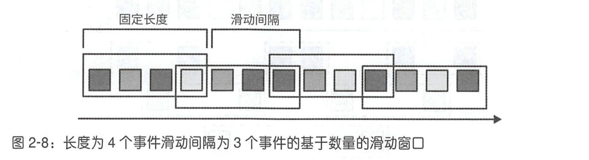
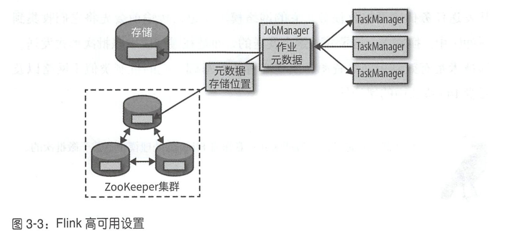
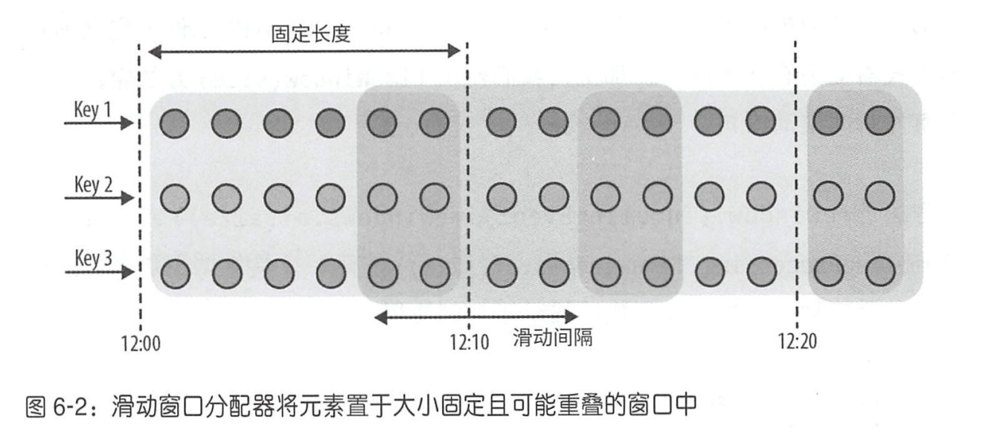

### 第1章 状态化流处理概述
### 第2章 流处理基础
### 第3章 Apache Flink架构
### 第4章 设置Apache Flink开发环境
### 第5章 DataStream API（1.7版本）
### 第6章 基于时间和窗口的算子
### 第7章 有状态算子和应用
### 第8章 读写外部系统
### 第9章 搭建Flink运行流式应用
### 第10章 Flink和流式应用运维

- [补充：FlinkSQL入门与实践](https://cloud.tencent.com/developer/article/1455860)
- [补充：[实时join]双流Join在不同层级的实现](https://blog.csdn.net/u011076848/article/details/124242146)
- [补充：[离线join]Hive关联优化方法](https://www.cnblogs.com/erlou96/p/13599964.html)


**Flink编程接口层级**
* `SQL API`：构建在`Table`之上，更专注业务本身而不是复杂的编程接口
* `Table API`：在数据流基础上可以实现流批统一，将数据类型统一抽象成表结构，通过`GroupByKey`/`Join`等操作符处理数据集
* `DataStream/DataSet API`：`DataStream`处理无界流数据，`DataSet`处理批量数据
* `Stateful Stream Processing API`：最底层，通过`process function`处理`event`/`state`/`time`

**流批统一**
* `FlinkSQL`（上面的层次一）
* `TableAPI`（上面的层次二）
* 两者可以看做同一层级，配合使用

**实时JOIN**
* `REGULAR JOIN`
* `INTERVAL JOIN`
* `WINDOW JOIN`

**离线JOIN**
* `COMMON JOIN`：最普通的策略，不受数据量大小影响
  - `map`：读取数据，以关联条件为键值，根据键值进行分区和排序
  - `shuffle`：根据键值进行哈希，分发给`reduce`，确保相同键值数据在同一个`reduce`
  - `reduce`：完成关联
* `MAP JOIN`：将小表的数据变成哈希表，广播到所有的`map`端，在`map`完成计算和关联
* `BUCKET MAP JOIN`：连接键是分桶键，且小表的分桶数是大表的倍数
* `MERGE SORT JOIN`：两个表在关联列上都有序，小表每次读取一部分，大表一行行匹配
  - 分桶表特殊情况：分桶键、连接键、排序键都为同一字段，连接时只需对具有相同桶编号的桶进行连接，无需对整个表进行连接

**Doris**
* 详见“分布式JOIN优化策略”

```
// 一、SQL API
// 窗口：处理无限流的核心，窗口把流分割为有限大小的桶，并在其之上进行计算
// 窗口表值函数：将表的数据划分到窗口中，返回表的原生列和附加的三个窗口列（窗口开始/窗口结束/窗口时间）
// 时间属性字段：必须为时间戳类型，在流计算模式中必须被指定为事件时间或处理时间
// 窗口偏移：默认为0，影响窗口的分配，不影响水位线

// 1、滚动窗口：TUMBLE(表名,时间字段,窗口大小,可选窗口偏移)
SELECT window_start, window_end, wimdow_time, SUM(price)
FROM TABLE(TUMBLE(TABLE Bid, DESCRIPTOR(bidtime), INTERVAL '10' MINUTES))
GROUP BY window_start, window_end, wimdow_time;  // 窗口的附加列

// 2、滑动窗口：HOP(表名,时间字段,窗口滑动步长,窗口大小,可选窗口偏移)
// 窗口大小为10分钟，每5分钟滑动一次，窗口有重叠，每行数据不只属于一个窗口
FROM TABLE(HOP(TABLE Bid, DESCRIPTOR(bidtime), INTERVAL '5' MINUTES, INTERVAL '10' MINUTES))

// 3、累计窗口：CUMULATE(表名,时间字段,窗口步长,窗口大小,可选窗口偏移)
// 窗口大小为10分钟，每2分钟累计一次
FROM TABLE(CUMULATE(TABLE Bid, DESCRIPTOR(bidtime), INTERVAL '2' MINUTES, INTERVAL '10' MINUTES))

// 三种关联方式，优先级从上到下，根据数据特点选择
// 1、REGULAR JOIN：基于无界数据进行关联
// 关联上的数据直接下发；没关联上的数据也下发，等到关联上再把之前的数据撤回然后下发
// 需要将两边的数据永远保持在状态中，状态可能无限增长，配置状态失效时间可能影响关联结果
SELECT *
FROM Orders
[INNER/LEFT/RIGHT/FULL OUTER] JOIN Product
ON Orders.ProductId = Product.ProductId

// 2、INTERVAL JOIN：A流关联B流中一段时间内的数据
// 只支持有时间属性的非更新表，超出边界的数据不可见并被清理掉，只需缓存边界内数据
SELECT *
FROM Orders o, Shipments s
WHERE o.id = s.order_id
AND o.order_time BETWEEN s.ship_time - INTERVAL '4' HOUR AND s.ship_time

// 3、WINDOW JOIN：两个流基于窗口关联，属于同一窗口的数据才能关联上
// 有可能发生数据漂移（同一主键的数据到达时间不同，属于两个不同窗口）数据质量低
SELECT *
FROM (SELECT * FROM TABLE(TUNBLE(TABLE L, DESCRIPTOR(row_time), INTERVAL '5' MINUTES))) L
JOIN (SELECT * FROM TABLE(TUNBLE(TABLE R, DESCRIPTOR(row_time), INTERVAL '5' MINUTES))) R
ON L.num = R.num AND L.window_start = R.window_start AND L.window_end = R.window_end

// 集合操作：并交叉
(SELECT s FROM t1) [UNION/INTERSECT/EXCEPT] [ALL] (SELECT s FROM t2)

// 子查询：优化器会改写为SEMI JOIN
SELECT user, amount
FROM Orders
WHERE product [IN/EXISTS] (SELECT product FROM NewProducts)

// 时间旅行：查询历史时点的表数据
SELECT * FROM table_name FOR SYSTEM_TIME AS OF TIMESTAMP '2023-07-01 00:00:00'

// ROWS间隔：定义聚合操作包含的精确行数
ROWS BETWEEN 10 PRECEDING AND CURRENT ROW

// RANGE间隔：定义排序列的间隔（前面的ORDER BY子句）
RANGE BETWEEN INTERVAL '30' MINUTES PRECEDING AND CURRENT ROW

// 项目配置和建表：FlinkSQL可以通过连接器直接对接Kafka，将Kafka Topic作为Source或Sink使用
// 0、项目依赖
<!-- Flink Kafka Connector -->
<dependency>
    <groupId>org.apache.flink</groupId>
    <artifactId>flink-connector-kafka_${scala.version}</artifactId>
    <version>${flink.version}</version>
</dependency>
<!-- JSON 格式支持 -->
<dependency>
    <groupId>org.apache.flink</groupId>
    <artifactId>flink-json</artifactId>
    <version>${flink.version}</version>
</dependency>

// 1、Kafka Source表
CREATE TABLE kafka_source (
    -- 字段定义（与 Kafka 消息格式匹配）
    user_id STRING,
    amount DOUBLE,
    transaction_time TIMESTAMP(3),
    proc_time AS PROCTIME(),  -- 定义处理时间（可选）
    WATERMARK FOR transaction_time AS transaction_time - INTERVAL '5' SECOND  -- 定义事件时间及Watermark
)
WITH (
    'connector' = 'kafka',  -- 连接器类型
    'topic' = 'input_topic',  -- 消息主题
    'properties.bootstrap.servers' = 'kafka-broker1:9092,kafka-broker2:9092',  -- broker地址列表
    'properties.group.id' = 'flink-group',  -- 消费者组
    'format' = 'json',  -- 数据格式：JSON/Avro/CSV等
    'scan.startup.mode' = 'latest-offset'  -- 消费起始位点：从最早/从最新
);

// 2、Kafka Sink表
CREATE TABLE kafka_sink (
    user_id STRING,
    total_amount DOUBLE,
    window_end TIMESTAMP(3)
)
WITH (
    'connector' = 'kafka',
    'topic' = 'output_topic',
    'properties.bootstrap.servers' = 'kafka-broker1:9092,kafka-broker2:9092',
    'format' = 'json',
    'sink.delivery-guarantee' = 'exactly-once',  -- 写入语义：exactly-once需开启Kafka事务
    'sink.transactional-id-prefix' = 'txn-'  -- 事务ID前缀：用于exactly-once
);

// 3、FlinkSQL处理逻辑
// 示例：统计每用户最近5分钟的累计交易金额
INSERT INTO kafka_sink
SELECT
    user_id,
    SUM(amount) AS total_amount,
    TUMBLE_END(transaction_time, INTERVAL '5' MINUTE) AS window_end
FROM kafka_source
GROUP BY
    user_id,
    TUMBLE(transaction_time, INTERVAL '5' MINUTE);

// 4、提交Flink作业（Java示例）
EnvironmentSettings settings = EnvironmentSettings.inStreamingMode();
TableEnvironment tableEnv = TableEnvironment.create(settings);
tableEnv.executeSql("CREATE TABLE ...");  // 替换为 DDL
tableEnv.executeSql("INSERT INTO kafka_sink SELECT ...");

// 二、DataStreamAPI & TableAPI
import org.apache.flink.streaming.api.scala._
import org.apache.flink.table.api.Table
import org.apache.flink.table.api.bridge.scala.StreamTableEnvironment
import org.apache.flink.table.api.Expression.$

case class Event(User: String, url: String, timeLength: Long)  // 样例类，定义表字段
object SimpleTableExample {
    def main(args: Array[String]): Unit = {
        // 一、DataStream API：输入流->表->输出流（借助数据流操作）
        // 1、读取（Source）
        val env = StreamExecutionEnvironment.getExecutionEnvironment  // 执行环境
        val eventStream = env.fromElements(Event("Alice","./home",1000L))  // 输入流
        val tableEnv = StreamTableEnvironment.create(env)  // 表环境

        // 2、转换（Transform）：查询结果注册成虚拟表，可以基于虚拟表再查询转换
        val eventTable: Table = tableEnv.fromDataStream(eventStream)  // 将输入流转换成表
        val eventView = tableEnv.fromDataStream(eventStream, $("timestamp").as("ts"), $("url"))  // 也可以创建虚拟视图
        val resultTable = eventTable.select($("user"), $("url")).where($("user").isEqual("Alice"))  // 写法1：API基于表查询
        val resultTable = tableEnv.sqlQuery("select user, url from " + eventTable + " where user = 'Alice'")  // 写法2：SQL基于表环境拼接表名

        // 3、输出（Sink）
        val resultStream = tableEnv.toDataStream(resultTable)  // 将表转换成输出流
        env.execute("simple table example")  // 执行应用
        resultTable.printSchema()  // 打印输出
        resultStream.print()

        // 二、TableAPI：创建输入表->基于输入表查询->写入输出表（基于表操作）
        tableEnv.executeSql("CREATE TEMPORARY TABLE inputTable(...) WITH('connector'='...'))  // 输入表连接外部输入源
        tableEnv.executeSql("CREATE TEMPORARY TABLE outputTable(...) WITH('connector'='...'))  // 输出表连接到外部系统
        val table = tableEnv.sqlQuery("SELECT ... FROM inputTable")
        val table = tableEnv.from("inputTable").select(...)  // 两种写法等价
        val tableResult = table.executeInsert("outputTable")  // 将结果写入输出表
    }
}

// 三、DataSet API：数据批处理
public class WordCountExample {
    public static void main(String[] args) throws Exception {
        final ExecutionEnvironment env = ExecutionEnvironment.getExecutionEnvironment();
        DataSet<String> text = env.fromElements(
            "Who's there?", "I think I hear them. Stand, ho! Who's there?"
        );
        DataSet<Tuple2<String, Integer>> wordCounts = text
            .flatMap(new LineSplitter())
            .groupBy(0)
            .sum(1);
        wordCounts.print();
    }
    public static class LineSplitter implements FlatMapFunction<String, Tuple2<String, Integer>> {
        @Override
        public void flatMap(String line, Collector<Tuple2<String, Integer>> out) {
            for (String word : line.split(" ")) {
                out.collect(new Tuple2<>(word, 1));
            }
        }
    }
}
```


### 第1章 状态化流处理概述

**数据处理**
* 事务型处理（OLTP）
* 分析型处理（OLAP）

**故障恢复**
* 有状态的流处理应用（运行在Flink上）
  - 利用之前的检查点恢复状态，并重置事件日志的读取位置
* 事件日志系统（通常是Kafka）
  - 持久化输入事件，应用从日志中读取并快速重放输入事件，直到追赶上数据流当前进度

**有状态的流处理应用**
* 事件驱动型应用
  - 实时推荐，模式识别，异常检测
* 数据管道应用
  - 以低延迟的方式获取、转换并插入数据
* 数据分析应用
  - 不需要等待周期性触发，而是持续获取事件流，不断更新结果

**第一代流处理系统**
* 并未针对流式应用结果的准确性和一致性提供内置保障
* 数据在出错时不会丢失，但可能会被处理多次
* 通过牺牲结果的准确度来获取低延迟

**Lambda架构**
* 普通层（准确结果）
  - 事件日志->导入->存储->批处理引擎->批处理表
* 提速层（近似结果）
  - 事件日志->流处理引擎->提速表
* 最后将批处理表和提速表整合为服务层，提供给应用

**Lambda架构缺点**
* 需要在两套独立处理系统之上实现两套语义相同的应用逻辑
* 流处理引擎计算结果只是近似的
* 很难配置和维护

**Apache Flink**
* 同时支持事件时间和处理时间语义
* 提供精确一次的状态一致性保障
* 毫秒级延迟
* 层次化的API在表达能力和易用性方面各有权衡
* 用于最常见存储系统的连接器
* 支持高可用性配置（无单点失效），快速故障恢复，动态扩缩容作业等，可以7*24小时运行流式应用，几乎无须停机
* 允许在不丢失应用状态的前提下更新作业的程序代码，或进行跨Flink集群的作业迁移
* 提供了详细、可自由定制的系统及应用指标集合，用于提前定位和响应问题
* 同时也是一个成熟的批处理引擎


### 第2章 流处理基础

**Dataflow程序**
* 描述数据如何在不同操作之间流动
* 为了执行Dataflow程序，需要将逻辑图转化为物理图

**算子**
* 基本功能单元
* 从输入获取数据，对其进行计算，产生数据并发往输出以供后续处理

**逻辑Dataflow图**
* 高层视角下的计算逻辑
* 通常表现为有向图，顶点称为算子，表示计算，边表示数据依赖关系
* 一个有向图至少要有一个数据源（没有输入端的算子）和一个数据汇（没有输出端的算子）


**物理Dataflow图**
* 指定程序的执行细节
* 顶点代表任务，算子包含多个并行算子任务，每个任务负责计算一部分输入数据
* 例如分布式处理引擎，每个算子可能会在不同物理机器上运行多个并行任务


**数据并行**
* 将输入数据分组，让同一操作的多个任务并行执行在不同数据子集上
* 能够将计算负载分配到多个节点上，从而处理大规模数据

**任务并行**
* 让不同算子的任务（基于相同或不同的数据）并行计算
* 可以更好地利用集群的计算资源

---

**数据交换策略**
* 如何将数据项分配给物理Dataflow图中的不同任务
* 可以由执行引擎根据算子的语义自动选择，也可以由开发人员显式指定
* 常见数据交换策略：转发、广播、基于键值、随机


**转发**
* 在发送端任务和接收端任务之间一对一地进行数据传输
* 如果两端任务运行在同一物理机器上，可以避免网络通信

**广播**
* 把每个数据项发往下游算子的全部并行任务
* 会把数据复制多份且涉及网络通信，代价十分昂贵

**基于键值**
* 根据某一键值属性对数据分区，保证键值相同的数据项会交由同一任务处理

**随机**
* 将数据均匀分配至算子的所有任务，以实现计算任务的负载均衡

---

**数据流**
* 可能无限的事件序列
* 利用Dataflow编程范式并行处理无限流事件
* 流式应用性能指标：延时、吞吐

**延迟**
* 处理一个事件所需的时间，从接收事件到在输出中观察到事件处理效果的时间间隔

**吞吐**
* 用来衡量系统处理能力，系统每单位时间可以处理多少事件

**背压**
* 系统持续以力不能及的高速率接收数据，未处理事件进入缓冲区，缓冲区用尽可能导致数据丢失

---

**流式操作状态**
* 无状态的
  - 处理事件时无需依赖已处理过的事件，也不保存历史数据，容易并行化，故障后重启容易
* 有状态的
  - 需要维护之前接收的事件信息，状态会根据传入的时间更新，并用于未来事件的处理逻辑中

**流式操作**
* 数据接入（Source）
* 数据转换（Transfrom）
* 数据输出（Sink）

**数据接入和数据输出**
* 流处理引擎和外部系统进行通信
* 数据接入（算子：数据源）
  - 从外部数据源获取原始数据，并将其转换为适合后续处理的格式（文件、Kafka主题、传感器数据接口）
* 数据输出（算子：数据汇）
  - 将数据以适合外部系统使用的格式输出（文件、数据库、消息队列或监控接口）

**转换算子**
* 无状态的
* 逐个读取事件，对其应用某些转换并产生一条新的输出流
* 转换逻辑可以是算子内置的，也可以由用户自定义函数提供
* 算子既可以同时接收多个输入流产生多条输出流，也可以通过单流分割或合并多条流来改变Dataflow图的结构


**聚合算子**
* 有状态的
* 根据每个到来的事件持续更新结果
* 前提：可结合，可交换
* 例子：持续求和/求最大值/求最小值，算子会维护当前结果，并根据每个到来的事件去更新这个值


**窗口算子**
* 有状态的
* 转换操作和滚动聚合每次处理一个事件来产生输出并（可能）更新状态，但有些操作必须收集并缓冲记录才能计算结果（例如流式Join或像是求中位数的整体聚合）
* 为了在无限数据流上高效执行这些操作，必须对操作所维持的数据量加以限制
* 窗口：持续创建一些称为桶的有限事件集合，并基于这些有限集进行计算
* 窗口策略：什么时候创建桶，事件如何分配到桶中，桶内数据何时参与计算
* 分配：可以基于时间、数量或者其他属性分配到不同桶中
* 触发：当触发条件满足时，桶内数据会发给一个计算函数，对桶中的元素应用计算逻辑

**窗口分类**
* 滚动窗口
* 滑动窗口
* 会话窗口

**滚动窗口**
* 将事件分配到大小固定且互不重叠的桶中
* 定义：窗口大小（间隔无需定义，与窗口大小相同）


**滑动窗口**
* 将事件分配到大小固定且允许相互重复的桶中（单个事件可能同时属于多个桶）
* 定义：窗口大小、滑动间隔
* 滑动间隔：每隔多久生成一个新的桶



**会话窗口**
* 根据会话间隔将事件分为不同的会话，属于同一会话的事件分配到相同桶中
* 会话间隔：会话在关闭前的非活动时间长度
* 会话长度：并非预先定义好，而是和实际数据有关
* 无论是滚动还是滑动窗口都无法用于该场景


**并行窗口**
* 上述窗口都是基于全局流数据的窗口，但在实际应用中可能会将数据流划分为多条逻辑流并定义一些并行窗口
* 例如，来自不同传感器的测量值，在应用窗口计算前按照传感器ID对数据流进行划分
* 并行窗口中，每个数据分区所应用的窗口策略都相互独立


**流处理核心概念**
* 时间语义
* 状态管理

**时间语义**
* 如何基于乱序事件产生精确结果
* 如何使用数据流进行历史事件处理（以相同的方式处理历史事件）

**算子语义**
* 应该依赖事件实际发生时间，而非应用收到事件的时间（短暂离线后上线）

**处理时间**
* 当前流处理算子所在机器上的本地时钟时间（离线后继续计时）
* 基于处理时间的窗口会包含在一段时间内到达窗口算子的事件

**事件时间**
* 数据流中事件实际发生的时间（附加在数据流中的事件的时间戳）
* 即使数据有延迟，也能准确将事件分配到窗口中，反映真实发生的情况
* 将处理速度和结果内容彻底解耦
* 基于事件时间的操作是可预测的，结果具有确定性，无论数据流处理速度快慢、事件到达算子的顺序如何，基于事件时间的窗口都会生成同样的内容
* 结合可重放的数据流，可以对历史数据进行快进，来分析历史数据；快进到赶上当前事件产生的进度，可以以完全相同的程序逻辑作为实时应用继续运行
* 问题：如何处理延迟事件

**处理时间和事件时间的区别**
* 处理时间
  - 提供了很低的延迟，注重处理速度，处理结果具有不确定性
  - 无需考虑迟到或乱序的事件，窗口只需简单地缓冲事件，然后在达到特定时间后立即触发窗口计算即可
  - 需要周期性地实时报告结果而无论其准确性如何（实时监控仪表盘，接收并展示事件处理结果）
* 事件时间
  - 能保证结果的准确性，可以处理延迟甚至无序的事件

**水位线**
* 全局进度指标，确信不会再有延迟事件到来的某个时间点
* 算子一且收到某个水位线，就可以触发窗口计算或对接收的数据进行排序了
* 在结果的准确性和延迟之间做出取舍

**水位线策略**
* 激进的水位线策略
  - 保证了低延迟，但随之而来的是低可信度，延迟事件可能在水位线之后到来，必须额外处理它们
* 保守的水位线策略
  - 虽然可信度得以保证，但可能会无谓地增加处理延迟

**处理迟到事件**
* 可能晚于水位线的迟到事件
* 处理方法：直接忽略、写入日志、修正之前的结果

**状态**
* 为了生成结果，函数会在一段时间或基于一定个数的事件来累积状态
* 有状态算子同时使用传入的事件和内部状态来计算输出

**旧的事件流处理方法（Spark Streaming微批）**
* 将到来事件分成小批次，然后不停地在批处理系统上调度并运行作业
* 每当一个作业结束，其结果都会写入持久化存储中，同时所有算子的状态将不复存在
* 一旦某个作业被调度到下个批次上执行，它将无法访问之前的状态
* 通常的解决方案是将状态管理交由某个外部系统（如数据库）完成，但会引入额外延迟

**持续运行的流式作业（Flink）**
* 每次处理事件所用到的状态都是持久化的
* 必须小心避免内部状态无限增长，算子通常都会只保留到目前为止所见事件的摘要或概览（数量值、累加值等）

**支持有状态算子将面临的挑战**
* 状态管理
  - 结果需要同时依赖状态和到来的事件，状态并行化会异常复杂，需要保证它们不受并发更新的影响
* 状态划分
  - 把状态按照键值划分，并独立管理每一部分
* 状态恢复
  - 有状态算子需要保证状态可以恢复，并且即使出现故障也要确保结果正确

**任务故障**
* 在流式作业中，算子的状态十分重要，需要在故障时予以保护
* 流处理引擎在出现任务故障时需要继续运行，还需要保证结果和算子状态的正确性

**流处理执行**
* 将程序翻译成物理Dataflow图，其中会包含很多相连的并行任务
* 每个任务都要运行一部分算子逻辑，消费输入流，并为其他任务生成输出流

**流处理步骤**
* 接收事件井将它们存在本地缓冲区
* 选择性地更新内部状态
* 产生输出记录
* 批处理：可以从头再来，所以不会有任何事件丢失，状态也可以从最初开始构建
* 流处理：通过不同的结果保障来定义故障时的行为

**结果保障：流处理引擎内部状态的一致性**
* 至多一次：事件可以随意丢弃，没有任何机制来保证结果的正确性
* 至少一次：正确性仅依赖信息的完整度，重复处理或许可以接受
* 精确一次：应用总会提供正确的结果，就如同故障从未发生过一般

**端到端的精确一次**
* 上述保障类型仅限于流处理引擎自身的应用状态，在实际流处理应用中，至少还要有一个数据来源组件和数据终点组件
* 端到端的保障：在整个数据处理管道上结果都是正确的，受制于保障最弱的组件
* 通过弱保障来实现强语义：比如求最值的幂等操作，可以用至少一次保障来实现精确一次的语义


### 第3章 Apache Flink架构

**分布式系统**
* 分配和管理集群计算资源
* 进程协调
* 数据存储：持久且高可用
* 故障恢复

**Flink特点**
* 与已有集群基础设施集成，专注核心功能（分布式数据流处理）
* 与集群管理器集成（Apache Mesos、YARN或Kubernetes）；或通过配置，作为独立集群来运行
* 没有提供分布式持久化存储，而是利用现有的分布式文件系统（如HDFS）或对象存储（如S3）
* 依赖Apache ZooKeeper来完成高可用设置中的领导选举工作

**Flink组件**
* JobManager
* ResourceManager
* TaskManager
* Dispatcher

**JobManager**
* 控制单个应用系统的执行
* 接收需要执行的应用（包含一个JobGraph，即逻辑Dataflow图）以及一个打包了所需类库和资源的JAR文件
* 将逻辑Dataflow图转换成物理Dataflow图（包含可以并行执行的任务）
* 从ResourceManager申请执行任务的必要资源（TaskManager处理槽）
* 将任务分发给TaskManager执行
* 负责所有需要集中协调的操作，如创建检查点

**ResourceManager**
* 负责管理处理资源单元（TaskManager处理槽）
* 如果处理槽数无法满足请求，可以和资源提供者通信，让它们提供额外容器来启动更多TaskManager进程
* 负责终止空闲的TaskManager以释放计算资源

**TaskManager**
* 工作进程
* 向ResourceManager注册处理槽，向JobManager提供一定数量的处理槽，处理槽数量限制一个TaskManager可执行的任务数
* 运行同一应用不同任务的TaskManager之间会产生数据交换

**Dispatcher**
* 跨多个作业执行，提供REST接口来提交需要执行的应用
* 一旦某个应用提交执行，Dispatcher会启动一个JobManager并将应用转交给它
* 同时还会启动一个WebUI，用来通过有关作业执行的信息
* 某些应用提交的方式可能用不到Dispatcher


**Flink应用部署**
* 框架模式（常用模式）
  - Flink应用打包成一个JAR文件，通过客户端提交到运行的服务上
* 库模式（常用于微服务架构）
  - Flink应用绑定到一个特定应用的容器镜像（如Docker镜像）中

**任务执行**
* 一个TaskManager允许同时执行多个任务，这些任务可以属于：
* 同一算子（数据并行）
* 不同算子（任务并行）
* 不同应用（作业并行）
* TaskManager通过提供固定数量的处理槽，来控制并行执行的任务数

**算子、任务以及处理槽**
* 左侧的JobGraph（应用的非并行化表示）包含了5个算子
* 算子A和C是数据源，算子E是数据汇
* 算子C和E的并行度是2，其余算子的并行度是4（应用执行至少需要4个处理槽，若干个TaskManager）
* JobManager将JobGraph展开成ExecutionGraph并把任务分配到4个处理槽
* TaskManager在同一个JVM进程内以多线程方式执行任务（和独立进程相比，线程更加轻量并且通信开销更低，但无法严格地将任务彼此隔离，只要有一个任务运行异常就会导致整个进程终止）
* 将每个TaskManager配置成一个处理槽，则可以限制应用在TaskManager级别进行隔离（每个TaskManager只运行单个应用的任务）
* 通过在TaskManager内部采取线程并行，以及在每个主机上部署多个TaskManager进程，Flink为部署应用时性能和资源隔离的取舍提供了极大的自由度


**故障恢复**
* TaskManager故障：无法提供足够的处理槽
* JobManager故障：高可用模式，原JobManager消失后将作业的管理职责以及元数据迁移到另一个JobManager
* ZooKeeper：用于领导选举，和持有故障恢复所需的远程存储数据路径


**JobManager故障恢复（选举新JobManager）**
* 向ZooKeeper请求存储位置，以获取JobGraph、JAR文件以及应用最新检查点在远程存储的状态句柄
* 向ResourceManager申请处理槽来继续执行应用
* 重启应用并利用最近一次检查点重置任务状态

**数据传输**
* 在应用运行过程中，任务会持续进行数据交换
* 记录并非逐个发送，而是在缓冲区中以批次形式发送（有效利用网络资源，实现高吞吐的基础）
* TaskManager负责将数据从发送任务传输到接收任务，每个TaskManager都有一个用于收发数据的网络缓冲池
* 如果发送端和接收端的任务运行在不同的TaskManager进程中，就要用到操作系统的网络栈进行通信（TCP连接）
* 当发送任务和接收任务在同一个TaskManager进程时，发送任务将要发送的记录序列化到一个字节缓冲区中，缓冲区满后会被放到一个队列里，接收任务会从这个队列里获取记录并将记录反序列化（同一个TaskManager内不同任务之间的数据传输不涉及网络通信）
* 在Shuffle连接模式下，每个发送端任务都需要向任意一个接收任务传输数据，对于每一个接收任务，TaskManager都要提供一个专用的网络缓冲区用于接收其他任务发来的数据


---

**降低任务间的通信开销**
* 基于信用值的流量控制
* 任务链接

**基于信用值的流量控制**
* 痛点：缓冲会增加延迟，记录首先要收集到缓冲区而不是立即发送
* 原理：接收端给发送端授予信用值（缓冲传输大小），发送端在信用值范围内传输缓冲数据，并附带积压值
* 接收端根据发送端的积压量信息来计算每个发送端在下一轮的信用优先级
* 发送端可以在接收端有足够资源时立即传输数据，所以可以有效降低延迟
* 该机制还能在出现数据倾斜时有效分配网络资源

**任务链接**
* 优点：降低本地任务之间的通信开销
* 前提：多个算子具有相同的并行度，且通过本地转发通道相连
* 执行：多个算子的函数被融合到同一个任务中，在同一个线程内执行，函数生成的记录只需要通过简单的方法调用，就可以分别发往各自的下游函数
* 不适用：需要对过长任务的链接进行切分，或者将两个计算量大的函数分配到不同的处理槽中


---

**事件时间处理**
* 时间戳
* 水位线
* 支持事件时间语义的流式应用

**时间戳**
* 在事件时间模式下，所有记录都必须包含时间戳，应用会根据记录的时间戳触发时间相关算子的计算（例如时间窗口算子根据时间戳将记录分配到不同窗口中）
* 实际上应用可以自由选择时间戳的含义，只要保证流记录的时间戳会随着数据流的前进大致递增即可（基本所有现实应用场景都会出现一定程度上的乱序）

**水位线**
* 一种特殊的记录，可以通过算子任务进行发送和接收
* 用途：在事件时间应用中推断每个任务当前的事件时间，触发计算并推动进度前进
* 属性：必须单调递增（确保任务中的事件时间始终正确前进，不会倒退）
* 含义：一个时间戳为T的水位线表示，接下来所有记录的时间戳都大于T，小于等于T的记录都到齐了
* 意义：允许应用控制结果的完整性和延迟（激进的水位线延迟低但完整性会受到影响，可能存在迟到数据没参与计算；保守的水位线会增加延迟，但结果的完整性也会有所提升）
* 任务内会维护一些计时器，它们依靠接收到水位线来激活（执行计算）


**任务处理水位线步骤**
* 基于水位线记录的时间戳更新内部事件时间时钟
* 任务的时间服务找出所有触发时间小于更新后事件时间的计时器，对于每个到期的计时器，调用回调函数，利用它来执行计算或发出记录
* 任务根据更新后的事件时间将水位线发出（水位线无法直接指定，需要由算子完成）

**分区水位线**
* Flink会将数据流划分为不同的分区，并将它们交由不同的算子任务来并行执行，每个分区作为一个数据流，都会包含带有时间戳的记录以及水位线
* 根据算子的上下游连接情况，其任务可能需要同时接收来自多个输入分区的记录和水位线，也可能需要将它们发送到多个输出分区
* 一个任务会为它的每个输入分区都维护一个分区水位线

**分区水位线处理过程**
* 以接收值和当前值中较大的那个去更新对应分区水位线的值
* 把事件时间时钟调整为所有分区水位线中最小的那个值
* 如果事件时间时钟向前推动，任务会先处理因此而触发的所有计时器，之后才会把对应的水位线发往所有连接的输出分区，以实现事件时间到全部下游任务的广播


**存在的问题**
* 水位线处理和传播算法，保证了算子任务所发出的记录时间戳和水位线一定会对齐（依赖于所有分区都会持续提供自增的水位线）
* 只要有一个分区的水位线没有前进，或分区完全空闲下来不再发送记录和水位线，任务的事件时间时钟就不会前进，继而导致计时器无法触发，会给靠时钟前进来执行计算或清除状态的时间相关算子带来麻烦
* 当算子的两个输入流的水位线差距很大时，也会产生类似影响，时钟会受制于相对较慢的流，较快流的记录或中间结果会在状态中缓冲，直到时钟到达允许处理它们的那个点

**时间戳分配和水位线生成的方式**
* 在数据源完成：利用SourceFunction在应用读入数据流时分配时间戳和生成水位线，如果源函数不再生成水位线，可以把自己声明为空闲，空闲源函数的流分区会在算子计算水位线的时候被排除在外
* 周期分配器：AssignerWithPeriodicWatermarks用户自定义函数，可以用来从每条记录提取时间戳，并周期性地响应获取当前水位线的查询请求
* 定点分配器：AssignerWithPunctuatedWatermarks用户自定义函数，用于需要根据特殊输入记录生成水位线的情况
* 用户自定义的时间戳分配函数通常都会尽可能地靠近数据源算子，不建议在流式应用中途覆盖已有的时间戳和水位线（虽然可以通过用户自定义函数实现）

**任务状态**
* 函数里所有需要任务区维护并用来计算结果的数据都属于任务的状态
* 可以想象成任务的业务逻辑所需要访问的本地或实例变量
* 任务接收输入数据，在处理数据的过程中对其状态进行读取或者更新，并根据状态和输入数据计算结果


**状态管理**
* 状态一致性
* 故障处理
* 高效存储
* 都由Flink负责搞定，开发人员可以专注于自己的应用逻辑

**状态分类**
* 算子状态（operator state）
* 键值分区状态（keyed state）

**算子状态**
* 作用域是某个算子任务
* 所有在同一个并行任务之内的记录都能访问到相同的状态


**算子状态原语**
* 列表状态：将状态表示为一个条目列表
* 联合列表状态：状态的恢复方式和普通列表状态有所不同
* 广播状态：专门为需要保证算子的每个任务状态都相同的场景而设计（有利于检查点保存或算子扩缩容）

**键值分区状态**
* 按照算子输入记录所定义的键值来进行维护或访问
* 位于处理对应键值记录的算子任务上
* 当任务在处理一个记录时，会自动把状态的访问范围限制为当前记录的键值
* 所有键值相同的事件就都能访问到一样的状态


**键值分区状态原语**
* 单值状态：每个键对应存储一个任意类型的值，值可以是某个复杂数据结构
* 列表状态：每个键对应存储一个值的列表，列表中的条目可以是任意类型
* 映射状态：每个键对应存储一个键值映射，该映射的键和值可以是任意类型

**状态后端**
* 有状态算子的任务通常会对每一条到来的记录读写状态，因此高效的状态访问对于记录处理的低延迟至关重要
* 为了保证有状态算子能快速访问状态，每个并行任务都会把状态维护在本地
* 状态具体的存储、访问和维护，由状态后端（可插拔组件）来决定
* 主要负责：本地状态管理，和将状态以检查点的形式写入远程持久化存储（可以是分布式系统或者某个数据库系统）

**有状态算子的扩缩容**
* 流式应用的一项基本需求是根据输入数据到达速率的变化调整算子的并行度
* 有状态算子改变并行度需要把状态重新分组，分配到与之前数量不等的并行任务上


**故障恢复**
* 发生故障时状态不丢不错
* 检查点：故障恢复机制基于检查点，提供精确一次的状态一致性保障
* 保存点：包含额外元数据的检查点

**创建一致性检查点的朴素策略**
* 暂停接收所有输入流
* 等待已经流入系统的数据被完全处理（所有任务已经处理完所有输入数据）
* 将所有任务的状态拷贝到远程持久化存储，生成检查点，所有任务完成拷贝后，检查点生成完毕
* 恢复所有数据流的接收
* Flink没有实现这种朴素策略，而是使用了一种更加复杂的检查点算法

**一致性检查点**
* 该应用有一个数据源任务，负责从一个递增数字流中读取数据
* 数字流被分成奇数流和偶数流，求和算子的两个任务分别对它们求和
* 数据源算子的任务会把输入流的当前偏移量存为状态
* 求和算子的任务会把当前和值存为状态


**从一致性检查点中恢复**
* 在流式应用执行过程中，Flink会周期性地为应用状态生成检查点，发生故障后从检查点恢复，提供精确一次的一致性保障
* 重启整个应用
* 利用最新的检查点重置任务状态
* 恢复所有任务处理


**精确一次输出**
* Flink的检查点和恢复机制仅能重置流式应用内部的状态
* 根据应用所采用的数据汇算子，在恢复期间，某些结果记录可能会向下游系统发送多次
* 对于某些存储系统，Flink提供的数据汇函数支持精确一次输出，例如在检查点完成后才把写出的记录正式提交，另一种适用于很多存储系统的方法是幂等更新

**Flink检查点算法**
* Flink没有使用朴素方法（暂停执行、生成检查点再恢复应用）
* Flink的检查点是基于Chandy-Lamport分布式快照算法实现的，不会暂停整个应用，而是把生成检查点的过程和处理过程分离（在部分任务持久化状态的过程中，其他任务还可以继续执行）

**检查点分隔符（checkpoint barrier）**
* 和水位线类似，分隔符这些特殊记录会通过数据源算子注入到常规的记录流中
* 为了标识所属的检查点，每个分隔符都会带有一个检查点编号，把一条流从逻辑上分为两个部分（先于分隔符的记录所引起的状态变更被包含在分隔符所对应的检查点中）


**检查点分隔符工作过程**
* JobManager向每个数据源任务发送一个新的检查点编号，以此来启动检查点生成流程
* 数据源任务收到消息后，暂停发出记录，等待所有分区的分隔符到齐；等待过程中，还未提供分隔符的分区发来的数据继续处理，已经提供分隔符的分区将新到来的记录缓冲起来，不能处理（分隔符对齐）
* 数据源任务收齐全部输入分区发送的分隔符后，通知状态后端开始生成检查点
* 数据源任务把该分隔符连同检查点编号，广播至所有输出的数据流分区
* 数据源任务在将所有分隔符发出后，开始处理缓冲的记录，之后恢复正常工作，继续处理输入流
* 检查点分隔符到达数据汇任务，数据汇任务依次执行分隔符对齐，将状态写入检查点，向JobManager发送确认消息
* JobManager接收到所有任务返回的检查点确认消息，将此次检查点标记为完成


**检查点对性能的影响**
* 任务将状态存入检查点的过程中，会处于阻塞状态，此时的输入会进入缓冲区
* 异步生成检查点：状态后端为当前状态创建本地拷贝，本地拷贝完成后继续任务处理，后台进程会异步将本地状态快照拷贝到远程存储，完成检查点后再通知任务，有效降低任务恢复数据处理所需等待的事件
* 增量生成检查点：有效降低需要传输的数据量
* 调整分隔符对齐：对于需要极低延迟且能容忍至少一次状态保障的应用，在分隔符对齐过程中不缓冲记录，而是直接处理它们（从检查点恢复后，这些记录会重复处理）

**保存点**
* 生成算法和检查点完全一样，保存点可以看做包含额外元数据的检查点
* 不是由Flink自动完成，而是需要由用户或外部调度器显式触发

**保存点用途**
* 修复问题：从保存点启用一个不同但相互兼容的应用
* 应用扩缩容：用不同的并行度启动原应用
* 应用迁移：将应用迁移到不同的Flink版本，或者不同的集群或数据中心
* 暂停应用：利用保存点暂停应用，稍后再把它启动起来，可以为更高优先级的应用腾出集群资源，或者在输入数据不连续的情况下及时释放资源
* 归档：为保存点设置不同版本并将应用状态归档，定期存档

**应用结构**
* 每个应用包含很多算子
* 每个算子定义一个或多个的键值或算子状态
* 算子在一个或多个任务上并行执行
* 因此一个典型的应用会包含多个状态，它们分布在不同TaskManager进程内的算子任务上

**从保存点启动应用**
* 应用包含3个算子，每个算子各有两个任务
* 算子1有一个算子状态，算子2有两个键值分区状态
* 在生成保存点的时候，所有任务的状态都会拷贝到某个持久化存储位置上
* 保存点的状态副本会按照算子标识和状态名称进行组织
* 应用从保存点启动时，Flink会将保存点的数据按照对应标识和状态名称分发到对应算子的任务上
* Flink会给每个算子分配一个唯一标识，但该标识会随前置算子的改变而变化，建议用户手工指定算子标识


### 第5章 DataStream API（1.7版本）

**示例：从多个传感器中获取温度测量数据流**
```
// 传感器读取数据的数据类型
case class SensorReading(
  id: String,
  timestamp: Long,
  temperature: Double
)

// 示例5-1：针对传感器数据流每5秒计算一次平均温度
object AverageSensorReadings {
  def main(args: Array[String]) {
    // 步骤1：设置流式执行环境
    val env = StreamExecutionEnvironment.getExecutionEnvironment
    env.setStreamTimeCharacteristic(TimeCharacteristic.EventTime)  // 在应用中使用事件时间

    // 步骤2：从流式数据源中创建相应类型的DataStream，读取数据流
    val sensorData: DataStream[SensorReading] = env
      .addSource(new SensorSource)  // 获取传感器读数
      .assignTimestampsAndWatermarks(new SensorTimeAssigner)  // 分配水位线和时间戳

    // 步骤3：通过一系列流式转换来实现应用逻辑
    val avgTemp: DataStream[SensorReading] = sensorData
      .map( r => {
        val celsius = (r.temperature - 32) * (5.0 / 9.0)
        SensorReading(r.id, r.timestamp, celsius)
       })  // 使用内联lambda函数将华氏温度转为摄氏温度
      .keyBy(_.id)  // 按照传感器id组织数据
      .timeWindow(Time.seconds(5))  // 将读数按5秒的滚动窗口分组
      .apply(new TemperatureAverager)  // 使用用户自定义函数计算平均温度

    // 步骤4：选择性地将结果输出到一个或多个数据汇中
    avgTemp.print()  // 将结果打印到标准输出

    // 步骤5：执行应用（此时才触发程序执行）
    env.execute("Compute average sensor temperature")
  }
}

// 设置执行环境
// 本地流式执行环境
val localEnv: StreamExecutionEnvironment.createLocalEnvironment()
// 远程流式执行环境
val remoteEnv = StreamExecutionEnvironment.createRemoteEnvironment(
  "host",                // JobManager主机名
  1234,                  // JobManager端口号
  "path/to/jarFile.jar"  // 需要传输到JobManager的JAR包
)
```

**DataStream API转换操作**
* 基本转换：作用于单个事件
* 基于keyedStream的转换：所有键值相同的事件，可以访问相同的状态
* 多流转换：将多条数据流合并为一条，或将一条数据流拆分为多条流
* 分发转换：对流中的事件进行重新组织，控制分区策略或自定义分区策略（处理数据倾斜，重新平衡数据）

**基本转换**
* `Map`：将每个输入事件转换为一个输出事件
* `Filter`：将布尔条件应用到每个输入事件，来进行过滤
* `FlatMap`：对每个输入事件产生零个、一个或多个输出事件


**基于keyedStream的转换**
* `keyBy`：将数据流转换成键值流
* `sum`/`min`/`max`/`minBy`/`maxBy`：滚动聚合
* `Reduce`：滚动聚合的泛化，对键值流应用一个函数，每个到来事件都和聚合结果做一次组合


**多流转换**
* `union`：合并两条或多条类型相同的流，事件按先进先出的顺序合并，数据流间的事件顺序不保证，不会对数据进行去重
* `connect`/`coMap`/`coFlatMap`：合并事件，返回一个联结流对象
* `split`/`select`：将一条流拆分为多条类型相同的输出流，每个事件都可以被发往零个、一个或多个输出流


**分发转换**
* 随机：shuffle()
* 轮流：rebalance()
* 重调：rescale()
* 广播：broadcast()
* 自定义：partitionCustion()


```
// 转换可以通过实现某个特定转换的接口类来定义
class MyMapFunction extends MapFunction[Int, Int] {
  override def map(value: Int): Int = value + 1
}

// 1、基本转换
// Map：产生一个新的DataStream
val readings: DataStream[SensorReading] = ...
val sensorIds: DataStream[String] = readings.map(r => r.id)  // 两种写法等价
val sensorIds: DataStream[String] = readings.map(new MyMapFunction)
class MyMapFunction extends MapFunction[SensorReading, String] {
  override def map(r: SensorReading): String = r.id  // 提取输入流中的id
}

// Filter：利用一个作用在流中每条输入事件上的布尔条件，来决定事件的去留
val readings: DataStream[SensorReading] = ...
val filteredSensors = readings.filter(r => r.temperature >= 25)  // 丢弃低于25的传感器测量值

// FlatMap：Filter和Map的泛化，能够实现后两者的操作
val sentences: DataStream[String] = ...
val words: DataStream[String] = sentences.flatMap(id => id.split(""))  // 按照空格分割字符，将分割得到的每个单词作为一条独立的记录发出去

// 2、基于keyedStream的转换：从逻辑上将事件按照键值分配到多条独立的子流中
// keyBy：指定键值，将DataStream转化为KeyedStream
val readings: DataStream[SensorReading] = ...
val keyed: KeyedStream[SensorReading, String] = readings.keyBy(r => r.id)

// 滚动聚合：生成一个包含聚合结果（求和、求最值）的DataStream
// 滚动聚合算子会对每一个遇到的键值保存一个聚合结果，每一个新事件到来都会更新聚合结果
// 应只对有限键值域使用滚动聚合：滚动聚合算子会为每个处理过的键值维护一个状态，状态不会被自动清理
val inputStream: DataStream[(Int, Int, Int)] = env.fromElements((1,2,2),(2,3,1),(2,2,4),(1,5,3))
// 结果：(键值,总和,无意义)；键值1：(1,2,2)->(1,7,2)；键值2：(2,3,1)->(2,5,1)
val resultStream: DataStream[(Int, Int, Int)] = inputStream
  .keyBy(0)  // 以元组第一个字段为键值进行分区
  .sum(1)    // 滚动计算每个分区内元组第二个字段的总和

// Reduce：滚动聚合转换的泛化
// 将一个ReduceFunction应用在一个KeyedStream上，每个到来事件都会和reduce结果进行一次组合，从而产生一个新的DataStream
// 不会改变数据类型，输出流的类型会永远和输入流保持一致
val inputStream: DataStream[(String, List[String])] = env.fromElements(
  ("en", List("tea")), ("fr",List("vin")), ("en", List("cake")))
val resultStream: DataStream[(String, List[String])] = inputStream
  .keyBy(0)  // 参数从0开始计数，占位符_从1开始计数
  .reduce((x, y) => (x._1, x._2 ::: y._2))  // 直接转发第一个字段（键值字段）并将第二个字段中列表的值连接合并起来

// 3、多流转换
// Union：合并两条或多条类型相同的DataStream，生成一个新的类型相同的DataStream
// 来自两条流的事件会以FIFO（先进先出）方式合并，其顺序无法得到保证
// 不会对数据进行去重，每个输入消息都会被发往下游算子
val parisStream: DataStream[SensorReading] = ...
val tokyoStream: DataStream[SensorReading] = ...
val rioStream: DataStream[SensorReading] = ...
val allCities: DataStream[SensorReading] = parisStream.union(tokyoStream, rioStream)

// Connect：接收一个DataStream并返回一个ConnectedStream（两个联结起来的流）
// 将两个数据流中具有相同键值的数据发往同一个算子实例上，两条流中的键值实体类型需要相同
val one: DataStream[(Int, Long)] = ...
val two: DataStream[(int, String)] = ...
// 对两个联结后的数据流按键值分区
val keyedConnect1: ConnectedStreams[(Int, Long), (int, String)] = one
  .connect(two)
  .keyBy(0, 0)  // 两个流都以第一个属性作为键值
// 或者是联结两个已经按键值分好区的数据流
val keyedConnect2: ConnectedStreams[(Int, Long), (int, String)] = one
  .keyBy(0)
  .connect(two.keyBy(0))
// 利用广播联结数据流
// 所有广播流的事件都会被复制多份，并发往后续处理元素所在算子的每个实例
// 非广播流的事件只是会被简单地转发
val keyedConnect: ConnectedStreams[(Int, Long), (int, String)] = one
  .connect(two.broadcast())  // 将第二条输入流广播

// Split：union转换的逆操作，将输入流分割成两条或多条和输入流相同类型的输出流
// 每一个到来的事件都可以被发往零个、一个或多个输出流（可以用来过滤或复制事件）
// 补充：针对处理函数的副输出功能，可以从函数中发出多条类型不同的数据流
val inputStream: DataStream[(int, String)] = ...
val splitted: SplitStream[(int, String)] = inputStream
  .split(t => if (t._1 > 1000) Seq("large") else Seq("small"))
val large: DataStream[(int, String)] = splitted.select("large")
var small: DataStream[(int, String)] = splitted.select("small")
var all: DataStream[(int, String)] = splitted.select("small", "large")

// 4、分发转换：控制分区策略
val numbers: DataStream[(Int)] = ...
numbers partitionCustom(myPartitioner, 0)
object myPartitioner extends Partitioner[Int] {
  val r = scala.util.Random
  override def partition(key: Int, numPartitions: Int): Int = {
    if (key < 0) 0 else r.nextInt(numPartitions)  // 负数定向发往第一个任务，其他数字随机选择一个任务发送
  }
}
```

**提交DataStream程序到JobManager上执行过程**
* 系统生成一个Dataflow图，并准备好用于执行的算子
* 每个算子产生一个或多个并行任务
* 每个任务负责处理算子的部分输入流
* 算子并行化任务的数目成为该算子的并行度

**设置并行度**
* 执行环境级别：根据应用启动时所处的上下文自动初始化
* 单个算子级别：默认为应用执行环境的并行度
* 最佳做法：将算子并行度设置为随环境默认并行度变化的值，这样可以通过提交客户端来轻易调整并行度，从而实现应用的扩缩容
```
// 获取执行环境
val env = StreamExecutionEnvironment.getExecutionEnvironment

// 访问环境的默认并行度
val defaultP = env.getParallelism

// 覆盖环境的默认并行度，完成之后将无法通过提交客户端控制应用并行度
env.setParallelism(32)

// 单独设置算子的并行度
val result = env.addSource(new CustomSource)
  .map(new MyMapper).setParallelism(defaultP * 2)
  .print().setParallelism(2)
```

**类型**
* Flink DataStream应用锁处理的事件会以数据对象的形式存在
* 函数调用时会传入数据对象，同时它也可以发出数据对象
* 处于网络传输、读写状态、检查点和保存点等目的，需要对它们进行序列化和反序列化
* 为了提高此过程的效率，有必要详细了解应用处理的数据类型
* Flink类型信息：标识数据类型，对于每种类型都会为其生成特定的序列化器、反序列化器和比较器
* Flink类型提取系统：通过分析函数的输入输出类型来自动获取类型信息，继而得到相应的序列化器和反序列化器
* 特殊情况：例如使用了Lambda类型或者泛型类型，必须显式指定类型信息

**Flink支持的数据类型**
* 原始类型
* Java和Scala元组
* Scala样例类
* POJO（包含Apache Avro生成的类）
* 数组、映射、枚举以及其他特殊类型
* 无法特别处理的类型会被当做泛型类型交给Kryo序列化框架进行序列化（通用序列化器）
```
// 1、原始类型：支持所有Java和Scala的原始类型，例如Int（Java中是Integer）、String、Long、Double
val numbers: DataStream[Long] = env.fromElements(1L,2L,3L,4L)
numbers.map(n => n + 1)  // 对每个元素加一

// 2、Java和Scala元组：元组是由固定数量的强类型字段所组成的复合数据类型
// DataStream的类型Tuple2[String, Integer]表示Person(name, age)
// Flink提供了Java元组的高效实现，最多可以包含25个字段，每个字段都对应一个单独的实现类（Tuple1、Tuple2到Tuple25）这些元组类都是强类型的
// Scala写法
val persons: DataStream[(String, Integer)] = env.fromElements(
  ("Adam", 17), ("Sarah", 23))
persons.filter(p => p._2 > 18)  // 过滤年龄大于18岁的人

// Java等价写法
DataStream<Tuple2<String, Integer>> persons = env.fromElements(
  Tuple2.of("Adam", 17),
  Tuple2.of("Sarah", 23));
persons.filter(p -> p.f1 > 18);

// Java元组中的各个字段可以使用公有字段名称（f0、f1、f2等）访问，也可以基于位置访问，位置下标从0开始
Tuple2<String, Integer> personTuple = Tuple2.of("Alex", 42);
Integer age = personTuple.getField(1);

// 对Java元组的字段进行更新（Java元组可变，与Scala不同）
personTuple.f1 = 42;          // 将第二个字段设为42
personTuple.setField(43, 1);  // 将第二个字段设为43

// 3、Scala样例类：按名称访问字段
case class Person(name: String, age: Int)  // 样例类：不可变，适合模式匹配
val presons: DataStream[Person] = env.fromElements(
  Person("Adam", 17), ("Sarah", 23))
persons.filter(p => p.age > 18)

// 4、POJO
public class Person {  // 公有类
  public String name;
  public int age;  // 所有字段都是公有类型
  public preson() {}  // 提供默认构造函数
  public Person(String name, int age) {
    this.name = name;
    this.age = age;
  }
}
DataStream<Person> persons = env.fromElements(
  new Person("Alex", 42),
  new Person("Wendy", 23));
```

**为数据类型创建类型信息**
* 自动推断：Flink类型系统会分析所需处理的每种数据类型，自动推断类型信息
* 显式指定：类型提取器失灵，或者需要定义自己的类型，需要为特定数据类型生成类型信息
```
// 1、通过辅助类的静态方法生成TypeInformation
// Java
import org.apache.flink.api.common.typeInfo.Types;
TypeInformation<Integer> intType = Types.INT;  // 原始类型
TypeInformation<Tuple2<Long, String>> tupleType = Types.TUPLE(Types.LONG, Types.STRING);  // 元组
TypeInformation<Person> personType = Types.POJO(Person.class);  // POJO

// Scala
import org.apache.flink.api.scala.typeutils.Types
val stringType: TypeInformation[String] = Types.STRING  //原始类型
val tupleType: TypeInformation[(Int, Long)] = Types.TUPLE[(Int, Long)]  // 元组
val caseClassType: TypeInformation[Person] = Types.CASE_CLASS[Person]  // 样例类

// 2、显式提供类型信息
// 方法1（Scala）：通过实现接口指定返回类型
class Tuple2T0PersonMapper extends MapFunction[(String, Int), Person]
  with ResultTypeQueryable  // 实现接口
  override def map(v: (String, Int)): Person = Person(v._1, v._2)
  override def getProducedType: TypeInformation[Person] = Types.CASE_CLASS[Person]  // 提供返回类型

// 方法2（Java）：定义DataFlow时显式指定某算子返回类型
DataStream<Tuple2<String, Integer>> tuples = ...
DataStream<Person> persons = tuples
  .map(t -> new Person(t.f0, t.f1))
  .returns(Types.POJO(Person.class));
```

**基于输入类型定义键值和引用字段**
```
// 1、字段位置
val input: DataStream[(Int, String, Long)] = ...
val keyed = input.keyBy(1, 2)  // 以元组的第二和第三个字段作为输入流的键值

// 2、字段表达式
// 样例类/POJO
case class SensorReading(id: String, timestamp: Long, temperature: Double)
val sensorStream: DataStream[SensorReading] = ...
val keyedSensors = sensorStream.keyBy("id")

// 元组：既可以用字段名称，也可以用字段索引
// 字段名称：Scala元组编号从1开始
val input: DataStream[(Int, String, Long)] = ...
val keyed2 = input.keyBy("_1")  // 字段名称：第一个字段
val keyed1 = input.keyBy("2")   // 字段索引：第三个字段

// 字段名称：Java元组编号从0开始
DataStream<Tuple3<Integer, String, Long>> javaInput = ...
javaInput.keyBy("f2")  // 字段名称：第三个字段

// POJO和元组中嵌套字段：用.来区分嵌套级别
case class Address(address: String, zip: String, country: String)
case class Person(name: String, birthday: (Int, Int, Int), address:Address)
val persons: DataStream[Person] = ...
persons.keyBy("address.zip")  // 以嵌套的POJO字段为键值
persons.keyBy("birthday._1")  // 在混合类型上嵌套表达式
persons.keyBy("birthday._")   // 用通配符选择全部字段

// 3、键值选择器：KeySelector函数可以从输入事件中提取键值（强类型，需要提供泛型参数）
// 指定输入事件中的字段
val sensorStream: DataStream[SensorReading] = ...
val byId: KeyedStream[SensorReading, String] = sensorData.keyBy(r => r.id)

// 指定经由计算得来的字段
val input: DataStream[(Int, Int)] = ...
val keyedStream = input.keyBy(value => math.max(value._1, value._2))  // 返回元组中最大的字段作为键值
```

**实现函数：定义和参数化函数的方式**
```
// 1、函数类：用户自定义函数的接口都以接口或抽象类的形式对外暴露
// 通过实现接口或继承抽象类的方式实现函数
// 方法1：将函数的实例作为参数传递给filter转换
class FlinkFilter extends FilterFunction[String] {
  override def filter(value: String): Boolean = {
    value.contains("flink")  // 过滤出包含该词的字符串
  }
}
val flinkTweets = tweets.filter(new FlinkFilter)
// 方法2：通过匿名类来实现函数
val flinkTweets = tweets.filter(
  new RichFilterFunction[String] {
    override def filter(value: String): Boolean = {
      value.contains("flink")
    }
  }
)
// 方法3：函数通过其构造函数接收参数
val tweets: DataStream[String] = ...
val flinkTweets = tweets.filter(new KeywordFilter("flink"))
class KeywordFilter(keyWord: String) extends FilterFunction[String] {
  override def filter(value: String): Boolean = {
    value.contains(keyWord)
  }
}

// 2、Lambda函数：在不需要进行高级操作的情况下，用简洁明了的方式实现应用逻辑
val tweets: DataStream[String] = ...
val flinkTweets = tweets.filter(_.contains("flink"))

// 3、富函数：相比普通函数可以提供更多功能，所有转换函数都有对应的富函数，以Rich+普通转换函数命名
class MyFlatMap extends RichFlatMapFunction[Int, (Int, Int)] {
  var subTaskIndex = 0
  // 初始化方法：在首次调用转换方法前调用一次，可以用于申请资源和建立连接
  override def open(configuration: Configuration): Unit = {
    subTaskIndex = getRuntimeContext.getIndexOfThisSubtask
  }
  // 转换方法：可以做一些额外处理工作
  override def flatMap(in: Int, out: Collector[(Int, Int)]): Unit = {
    if(in % 2 = subTaskIndex) {
      out.collect((subTaskIndex, in))
    }
  }
  // 终止方法：在最后一次调用转换方法后调用一次，通常用于清理和释放资源
  override def close(): Unit = {}
}
```

**导入外部和FLink依赖**
* Flink应用不仅需要依赖DataStream API和Java SDK，还需要额外的第三方库以及Flink内部依赖
* 默认情况下Flink集群只会加载核心API依赖，其他依赖必须显式提供
* 用户使用的类库一多，容易出现导入统一类库多个版本的情况，很多问题都是源于类库版本冲突

**依赖访问**
* 将全部依赖打进应用的JAR包，会导致文件很大（推荐）
* 将依赖的JAR包放到Flink./lib目录中，在Flink进程启动时会将依赖加载到Classpath中，这种做法会对同一Flink环境中所有运行的应用可见（可能会造成干扰）
* JAR包会自动排除在Classpath中包含的依赖，Maven项目的pom.xml文件可以配置额外依赖


### 第6章 基于时间和窗口的算子

**配置时间特性**
* 处理时间：ProcessingTime
* 事件时间：EventTime
* 混合体：IngestionTime

**分配时间戳和生成水位线**
* 每个事件关联一个时间戳
* 数据流需要携带水位线，水位线包含时间戳

**时间戳分配器**
* 一旦使用时间戳分配器，已有的时间戳和水位线都将被覆盖
* 为了保证事件时间相关操作能够正常工作，必须将分配器放在任何依赖事件时间的转换之前（例如在第一个事件时间窗口之前）
* 尽可能在靠近数据源的地方，或在数据源内部，分配时间戳并生成水位线
* 工作原理和转换算子类似，会作用在数据流的元素上面，生成一条带有时间戳和水位线的新数据流，数据类型不变
```
object AverageSensorReadings {
  def main(args: Array[String]) {
    val env = StreamExecutionEnvironment.getExecutionEnvironment
    env.setStreamTimeCharacteristic(TimeCharacteristic.EventTime)  // 使用事件时间
    val stream: DataStream[SensorReading] = env
      .addSource(...)  // 读入传感器流
      .assignTimestampAndWatermarks(new MyAssigner)  // 时间戳分配器
  }
}

// 周期性水位线分配器：检查事件的时间戳大于上一个水位线，发出一个新的水位线（保证事件时间持续递增）
// 用法1：每隔5秒发出一次水位线
env.getConfig.setAutoWatermarkInterval(5000)
// 用法2：跟踪至今为止所遇到的最大时间戳来生成水位线，返回新水位线=最大时间戳-1分钟容忍间隔
class PeriodicAssigner extends AssignerWithPeriodicWatermarks[SensorReading] {
  val bound: Long = 60 * 1000  // 1分钟的毫秒数
  var maxTs: Long = Long.MinValue  // 观察到的最大时间戳
  override def getCurrentWatermark: Watermark = {
    new Watermark(maxTs - bound)  // 生成具有1分钟容忍度的水位线
  }
  override def extractTimestamp(r: SensorReading, previousTS: Long): Long = {
    maxTs = maxTs.max(r.timestamp)  // 更新最大时间戳
    r.timestamp  // 返回记录的时间戳
  }
}
// 用法3：使用当前时间戳生成水位线，适用于输入元素的时间戳单调递增的情况
val output = stream.assignAscendingTimestamps(e => e.timestamp)
// 用法4：已知输入流中的最大预期延迟
val output = stream.assignTimestampsAndWatermarks(
  new BoundedOutOfOrdernessTimestampExtractor[SensorReading](
    Time.seconds(10))(e => e.timestamp)
)

// 定点水位线分配器：输入流中包含用于指示系统进度的特殊元组或标记
class PunctuatedAssigner extends AssignerWithPunctuatedWatermarks[SensorReading] {
  val bound: Long = 60 * 1000  // 1分钟的毫秒数
  override def checkAndGerNextWatermark = {
    if (r.id == <<sensor_1>>) {
      new Watermark(extractedTS - bound)  // 如果读数来自sensor_1则发出水位线
    }
    else {
      null  // 不发出水位线
    }
  }
  override def extractTimestamp(r: SensorReading, previousTS: Long): Long = {
    r.timestamp  // 为记录分配水位线
  }
}
```

**水位线、延迟及完整性问题**
* 水位线可用于平衡延迟和结果的完整性
* 宽松的水位线将导致产生结果的延迟增大
* 紧迫的水位线会导致结果不完整或不准确，但可以以较低延迟及时生成结果

**处理函数**
* DataStream API无法访问时间信息和水位线，处理函数（相对底层的转换）不同
* 除了基本功能，还可以访问记录的时间戳和水位线
* 支持注册在将来某个特定时间触发的计时器
* 副输出功能允许将记录发送到多个输出流中
* 通常被用于构建事件驱动型应用，或实现一些内置窗口及转换无法实现的自定义逻辑
* 大多数Flink SQL支持的算子都是利用处理函数实现的
* 实现RichFunction接口

**处理函数列表**
* ProcessFunction
* KeyedProcessFunction
* CoProcessFunction
* ProcessJoinFunction
* BroadcastProcessFunction
* KeyedBroadcastProcessFunction
* ProcessWindowFunction
* ProcessAllWindowFunction

**KeyedProcessFunction**
* 作用于KeyedStream之上，针对流中的每条记录调用一次，并返回零个、一个或多个记录
* 实现RichFunction接口，支持open、close、getRuntimeContext等方法
* processElement方法：针对流中的每条记录调用一次
* onTimer方法：回调函数会在之前注册的计时器触发时被调用

**时间服务**
* Context和onTimerContext对象的TimerService提供以下方法：
* currentProcessingTime：返回当前处理时间
* currentWatermark：返回当前水位线的时间戳
* registerProcessingTimeTimer
* registerEventTimeTimer
* deleteProcessingTimeTimer
* deleteEventTimeTimer

**计时器**
* 只允许在按键值分区的数据流上注册
  - 如果需要在非键值分区的数据流上使用计时器，可以通过在KeySelector中返回一个常数键值来创建一条键值分区数据流，该操作会使所有数据发送到单个任务上，从而强制算子以并行度1来执行
* 对于每个键值和时间戳只能注册一个计时器
  - 每个键值可以有多个计时器，但具体到每个时间戳就只能有一个
* 所有计时器会和其他状态一起写入检查点（异步）
  - 建议不要使用太多计时器，以避免检查点生成时间过久

**窗口算子**
* 窗口：在无限数据流上基于有界区间实现聚合等转换
* 窗口算子：基于有限大小的桶对事件进行分组，并对这些桶中的有限内容进行计算
* 用在键值分区的数据流上：可以并行计算
* 用在非键值分区的数据流：只能单线程处理，不支持并行计算，收集全量数据

**窗口算子组件**
* 窗口分配器：决定输入流中的元素该如何划分
* 窗口函数：用于处理分配到窗口中元素

**内置窗口分配器**
* 常见的窗口使用场景
* 提供默认的触发器，时间戳超过窗口的结束时间就触发窗口计算
* 窗口类型为TimeWindow，表示两个时间戳之间的时间区间（左闭右开）
* 对外提供了获取窗口边界、检查窗口是否相交以及合并重叠窗口等方法

**窗口类型**
* 基于时间的窗口：事件时间，处理时间
* 基于数量的窗口：按照元素到达窗口算子的顺序，以固定数量对其进行分组；具有不确定性（需要为其自定义触发器，来丢弃不完整或过期的窗口）
* 窗口随系统首次为其分配元素而创建，不会对空窗口执行计算
```
// 键值分区窗口算子
stream
  .keyBy(...)
  .window(...)  // 指定窗口分配器
  .reduce/aggregate/process(...)  // 指定窗口函数

// 非键值分区全量窗口算子
stream
  .windowAll(...)  // 指定窗口分配器
  .reduce/aggregate/process(...)  // 指定窗口函数
```

**滚动窗口分配器**
* 大小固定
* 互不重叠


```
val sensorData: DataStream[SensorReading] = ...
val avgTemp = sensorData
  .keyBy(_.id)
  // 将读数按照1秒事件时间/处理时间窗口分组
  .window(TumblingEventTimeWindows.of(Time.seconds(1)))  // 基于事件时间
  .window(TumblingProcessingTimeWindows.of(Time.seconds(1)))  // 基于处理时间
  .timeWindow(Time.seconds(1))  // 以上两条语句的简写，具体调用哪个方法取决于配置的时间特性
  // 将读数按照大小1小时，偏移量15分钟的时间窗口分组
  .window(TumblingEventTimeWindows.of(Time.hours(1), Time.minutes(15)))
  .process(new TemperatureAverager)
```

**滑动窗口分配器**
* 大小固定
* 可能重叠

```
val sensorData: DataStream[SensorReading] = ...
val slidingAvgTemp = sensorData
  .keyBy(_.id)
  // 每隔15分钟创建1小时的事件时间/处理时间窗口
  .window(SlidingingEventTimeWindows.of(Time.hours(1), Time.minutes(15)))  // 基于事件时间
  .window(SlidingProcessingTimeWindows.of(Time.hours(1), Time.minutes(15)))  // 基于处理时间
  .timeWindow(Time.hours(1), Time.minutes(15))  // 简写
  .process(new TemperatureAverager)
```

**会话窗口分配器**
* 会话窗口的开始和结束都取决于接收的元素，分配器无法实时将所有元素分配到正确窗口
* 分配器将每个到来的元素映射到一个它自己的窗口中，该窗口的起始时间是元素的时间戳，大小为会话间隔，随后分配器会将所有范围存在重叠的窗口合并

```
val sensorData: DataStream[SensorReading] = ...
val sessionWindows = sensorData
  .keyBy(_.id)
  // 创建15分钟间隔的事件时间/处理时间会话窗口
  .window(EventTimeSessionWindows.of(Time.minutes(15)))  // 基于事件时间
  .window(ProcessingTimeSessionWindows.of(Time.minutes(15)))  // 基于处理时间
  .process(new TemperatureAverager)
```

---

**窗口组件**
* 分配器（必选）
  - 元素放入哪个窗口（零个、一个或多个窗口），如果窗口不存在则进行创建
* 触发器（可选）
  - 元素放入窗口后，何时执行计算、发出结果和清除内容（时间条件或数据条件）
  - 如果不定义，会分配一个默认触发器，在处理时间或水位线超过窗口结束时间时触发
* 窗口函数（必选）
  - 执行计算的具体逻辑
* 移除器（可选）
  - 从窗口中删除已经收集的元素
  - 需要遍历所有元素，只有在未指定增量聚合函数时才可以使用

**触发器触发逻辑**
* 窗口接收到一定数量的元素时
* 含有某个特定值的元素加入窗口时
* 检测到添加的元素满足某种模式时（如5秒内出现了两个相同类型的事件）
* 在水位线到达窗口的结束时间以前，为窗口计算并发出早期结果（在保守的水位线策略下依然可以产生非完整的低延迟结果）
* 可以触发多次
* 可以计算全新结果，可以对已有结果进行更新，可以只清除窗口而不发出结果

**可用于窗口的函数**
* 增量聚合函数：发出当前聚合结果（ReduceFunction和AggregateFunction）
* 全量窗口函数：一次性作用于窗口内的所有元素（ProcessWindowFunction）
* 组合使用：全量窗口函数作用在增量聚合函数产生的聚合值上，再发出结果


**自定义窗口算子（举例）**
* 窗口需要提前发出结果，并在之后遇到迟到元素时对结果进行更新
* 窗口需要以特定记录作为开始或结束的边界

**窗口生命周期**
* 创建：窗口分配器首次向窗口分配元素时（意味着每个窗口至少有一个元素）
* 删除：窗口算子在窗口结束时间到达时删除窗口，自动清除窗口内容并丢弃窗口对象（自定义触发器需要手动清理）

**窗口状态**
* 窗口内容：分配给窗口的元素，和增量聚合结果
* 窗口对象：保存用于区分窗口的信息（如开始时间和结束时间），窗口算子根据返回的窗口对象对元素进行分组
* 触发器中的计时器：由窗口算子负责维护
* 触发器中的自定义状态：定义针对不同窗口和键值的自定义状态，由触发器来控制

```
// 1、增量聚合函数
// ReduceFunction：比较元素和窗口状态中的当前聚合值，并更新结果（替换窗口状态）
// 输入、输出类型必须一致，仅限于一些简单的聚合
val minTempPerWindow: DataStream[(String, Double)] = sensorData
  .map(r => (r.id, r.temperature))
  .keyBy(_._1)
  .timeWindow(Time.seconds(15))  // 计算每15秒的最低温度
   // r1和r2两个元组，id一样时，比较温度较小值，并更新结果
  .reduce((r1, r2) => (r1._1, r1._2.min(r2._2)))

// AggregateFunction：相比ReduceFunction更加灵活
// 中间数据类型以及结果类型不再依赖输入类型
val avgTempPerWindow: DataStream[(String, Double)] = sensorData
  .map(r => (r.id, r.temperature))
  .keyBy(_._1)
  .timeWindow(Time.seconds(15))
  .aggregate(new AvgTempFunction)  // 与reduce不同，传入一个函数
class AvgTempFunction extends AggregateFunction  // 计算传感器平均温度
  [(String, Double), (String, Double, Int), (String, Double)] {
    override def createAccumulator() = {
      ("", 0.0, 0)
    }
    override def add(in: (String, Double), acc: (String, Double, Int)) = {  // 累加器
        (in._1, in._2 + acc._2, 1 + acc._3)  // (id, 温度总和, 事件总数)
    }
    override def getResult(acc: (String, Double, Int)) = {
      (acc._1, acc._2 / acc._3)  // (id, 平均温度)
    }
    override def merge(acc1: (String, Double, Int), acc2: (String, Double, Int)) = {
      (acc1._1, acc1._2 + acc2._2, acc1._3 + acc2._3)  // 按照id合并
    }
}

// 2、全量聚合函数
// ProcessWindowFunction：访问窗口内所有元素，执行任意计算（收集全部状态）
// 单个窗口状态：只能在窗口内访问；全局状态：在键值相同的多个窗口之间共享信息
val minMaxTempPerWindow: DataStream[MinMaxTemp] = sensorData
  .keyBy(_._1)
  .timeWindow(Time.seconds(5))  // 按照每5秒的滚动窗口进行分组
  .process(new HighAndLowTempProcessFunction)  // 计算每个窗口的最高温和最低温
case class MinMaxTemp(id: String, min: Double, max: Double, endTs: Long)
class HighAndLowTempProcessFunction extends ProcessWindowFunction
  [SensorReading, MinMaxTemp, String, TimeWindow] {
    override def process(
      key: String,
      ctx: Context,
      vals: Iterable[SensorReading],
      out: Collector[MinMaxTemp]): Unit = {
        val temps = vals.map(_.temperature)  // 获取所有温度
        val windowEnd = ctx.window.getEnd
        // 将最高温、最低温连同窗口结束时间戳一起发出
        out.collect(MinMaxTemp(key, temps.min, temps.max, windowEnd))
    }
}

// 3、组合使用：增量聚合函数（计算逻辑）+ 全量聚合函数（访问窗口元数据）
// 对分配给窗口的元素立即执行聚合，当窗口触发器触发时，再将聚合结果传给process
val minMaxTempPerWindow: DataStream[MinMaxTemp] = sensorData
  .map(r => (r.id, r.temperature, r.temperature))  // (id, 温度, 温度)
  .keyBy(_._1)
  .timeWindow(Time.seconds(5))  // 按照每5秒的滚动窗口进行分组
  .reduce(
    // 增量计算最低和最高温度
    (r1: (String, Double, Double), r2: (String, Double, Double)) = {
      (r1._1, r1._2.min(r2._2), r1._3.max(r2._3))  // (id, 最低温, 最高温)
    },
    // 在process中计算最终结果
    new HighAndLowTempProcessFunction()
  )
case class MinMaxTemp(id: String, min: Double, max: Double, endTs: Long)
class HighAndLowTempProcessFunction extends ProcessWindowFunction
  [SensorReading, MinMaxTemp, String, TimeWindow] {
    override def process(
      key: String,
      ctx: Context,
      minMaxIt: Iterable[(String, Double, Double)],  // 迭代器样式跟上面的元组一样
      out: Collector[MinMaxTemp]): Unit = {
        val minMax = minMaxIt.head
        val windowEnd = ctx.window.getEnd
        out.collect(MinMaxTemp(key, minMax._2, minMax._3, windowEnd))
    }
}

// 4、窗口组件
stream
  .keyBy(...)
  .window(...)    // 指定窗口分配器
 [.trigger(...)]  // 可选项：指定触发器
 [.evictor(...)]  // 可选项：指定移除器
  .reduce/aggregate/process(...)  // 指定窗口函数
```

---

**双流Join：对两条流中的事件进行联结**
* 基于间隔的Join
* 基于窗口的Join

**基于间隔的Join**
* 两条流中拥有相同键值，且时间戳不超过指定间隔的元素
* 只支持事件时间和`INNER JOIN`语义
* 间隔范围：[水位线-间隔上界, 水位线+间隔下界]
* 具有对称性：B中事件相较于A中事件的时间戳不早于1小时且不晚于15分钟，反之亦然
* 需要同时对双流的记录进行缓冲，如果两条留中的事件时间不同步，缓存会显著增加


**基于窗口的Join**
* 将两条流中的元素分配到公共窗口，并在窗口完成时进行Join
* 如果是滚动窗口，来自两个输入的元素没有被分配到同一窗口，就无法Join在一起


```
// 1、基于间隔的Join
input1
  .keyBy(_.id)
  .between(Time.hour(-1), Time.minutes(15))  // 相较于input1的上下界
  .process(ProcessJoinFunction)  // 处理匹配的事件对

// 2、基于窗口的Join
input1.join(input2)
  .where(...)     // 为input1指定键值属性
  .equal_to(...)  // 为input2指定键值属性
  .window(...)    // 指定窗口分配器
 [.trigger(...)]  // 可选项：指定触发器
 [.evictor(...)]  // 可选项：指定移除器
 .apply(...)      // 指定Join Function：对每个输入事件都会调用一次
```

---

**迟到事件**
* 事件到达算子时，窗口分配器为其分配的窗口已经因为水位线超过了窗口结束时间而计算完毕
* 处理函数可以通过比较事件时间戳和当前水位线来识别迟到事件

**迟到数据处理**
* 丢弃迟到事件
* 重定向迟到事件
* 基于迟到事件更新结果

**丢弃迟到事件**
* 迟到的元素将不会创建新的窗口
* 处理函数识别迟到时间后过滤掉

**重定向迟到事件**
* 利用副输出将迟到事件重定向到另一个数据流中
* 可通过定期回填集成到流式应用的结果中

**基于迟到事件更新结果**
* 在算子中保持状态：需要保留用于再次计算结果的状态，一旦清除了针对特定结果的状态，这些结果就再也无法更新，而迟到时间也只能被丢弃或重定向
* 受结果更新影响下游算子或外部系统还得能处理这些更新（Upsert写入模式）
* 设置延迟容忍度：窗口算子会将窗口继续保留该延迟容忍度的时间，在这期间的迟到元素会像按时到达的元素一样交给触发器处理；当水位线超过窗口结束时间加延迟容忍度间隔，窗口才会被最终删除，此后到达的所有迟到事件都将直接丢弃

```
val readings: DataStream[SensorReading] = ...

// 1、重定向迟到事件
// 做法1：在窗口算子中为迟到事件指定副输出
val countPer10Secs: DataStream[(String, Long, Int)] = readings
  .keyBy(_.id)
  .timeWindow(Time.seconds(10))
   // 将迟到读数发至副输出
  .sideOutputLateData(new OutputTag[SensorReading]("late-readings"))
   // 计算每个窗口内的读数个数
  .process(new CountFunction())

// 做法2：从输入中过滤出迟到的传感器读数，并将其重定向到副输出流中
val filteredReadings: DataStream[SensorReading] = readings
  .process(new LateReadingsFilter)
class LateReadingsFilter extends ProcessFunction[SensorReading, SensorReading] {
  val lateReadingsOut = new OutputTag[SensorReading]("late-readings")
  override def processElement(
    r: SensorReading,
    ctx: ProcessFunction[SensorReading, SensorReading]#Context,
    out: Collector[SensorReading]): Unit = {
      // 比较记录时间戳和当前水位线
      if (r.timestamp < ctx.timerService().currentWatermark()) {
        // 将迟到数据重定向到副输出
        ctx.output(lateReadingsOut, r)
      } else {
        out.collect(r)
      }
    }
}

// 共同步骤：从副输出中获取迟到事件的数据流
val lateStream: DataStream[SensorReading] = filteredReadings
  .getSideOutput(new OutputTag[SensorReading]("late-readings"))

// 2、基于迟到事件更新结果
// 定义延迟容忍度为5秒的窗口算子
val countPer10Secs: DataStream[(String, Long, Int, String)] = readings
  .keyBy(_.id)
  .timeWindow(Time.seconds(10))
  .allowedLateness(Time.seconds(10))  // 额外处理5秒的迟到读数
  .process(new UpdatingWindowCountFunction)  // 如果遇到迟到事件，重新计数并更新结果
class UpdatingWindowCountFunction extends ProcessFunction
  [SensorReading, (String, Long, Int, String), String, TimeWindow] {
    override def process(
      id: String,
      cts: Context,
      elements: Iterable[SensorReading],
      out: Collector[(String, Long, Int, String)]): Unit = {
        val cnt = elements.count(_ => true)
        val isUpdate = ctx.windowState.getState(
          new ValueStateDescriptor[Boolean]("isUpdate", Types.of[Boolean]))  // 识别是否第一次对窗口进行计算
        if (!isUpdate.value()) {  // 首次计算，并发出结果
          out.collect((id, ctx.window.getEnd, cnt, "first"))
          isUpdate.update(true)
        } else {  // 并非首次计算，发出更新
          out.collect((id, ctx.window.getEnd, cnt, "update"))
        }
    }
}
```


### 第7章 有状态算子和应用

**状态化流处理用途**
* 故障恢复
* 内存管理
* 流式应用运维

**流式应用组成**
* 有状态算子
* 用户函数

**状态**
* 对数据记录进行缓冲
* 对中间结果及元数据加以维护

**状态分类**
* 键值分区状态：只能由作用在KeyedStream上面的函数使用
* 算子状态

**键值分区状态**
* 分布在函数所在算子的所有并行任务上
* 每个函数的并行实例都会负责一部分键值域，并维护相应的状态实例
* 调用函数的处理方法时，会自动将函数中的键值分区状态放入到当前处理记录的键值上下文中，函数每次只能访问属于当前处理记录的键值的状态
* 类似一个分布式状态映射

**键值分区状态原语（单个键值对应的状态结构）**
* ValueState[T]
* ListState[T]
* MapState[K,V]
* ReducingState[T]
* AggregatingState[I,O]

**算子状态**
* 按照每个算子并行实例来分配算子状态
* 同一个算子并行任务，在处理任何事件时都可以访问到相同的状态
* 将算子状态作为状态列表对象来处理，可以对使用了算子状态的函数修改并行度（将算子状态重新分配到更多或更少的任务实例中，需要拆分或合并状态对象）

**算子状态分类**
* 列表状态
* 联合列表状态
* 广播状态

```
val SensorData: DataStream[SensorReading] = ...
val keyedData: KeyedStream[SensorReading, String] = sensorData.keyBy(_.id)

// 1、键值分区状态
// 在键值分区数据流上应用一个有状态的FlatMapFunction，来比较读数并发出警报
val alerts: DataStream[(String, Double, Double)] = keyedData
  .flatMap(new TemperatureAlertFunction(1.7))
class TemperatureAlertFunction(val threshold: Double)
  extends RichFlatMapFunction[SensorReading, (String, Double, Double)] {
    private var lastTempState: ValueState[Double] = _   // 赋予默认的初始值
    override def open(parameters: Configuration): Unit = {
      // 创建状态描述符
      val lastTempDescriptor = new ValueStateDescriptor[Double]("lastTemp", classOf[Double])
      // 根据状态描述符获取引用状态（状态引用对象只提供接口，不存储状态本身，存储由状态后端完成）
      lastTempState = getRuntimeContext.getState[Double](lastTempDescriptor)
    }
    override def flatMap(reading: SensorReading, out: Collector[(String, Double, Double)]): Unit = {
      val lastTemp = lastTempState.value()  // 从状态中获取上一次的温度
      val tempDiff = (reading.temperature - lastTemp).abs
      if (tempDiff > threshold) {  // 温差超过阈值
        out.collect((reading.id, reading.temperature, tempDiff))
      }
      this.lastTempState.update(reading.temperature)  // 更新状态
    }
}

// 上例更简洁的写法（使用Scala DataStream API）
val alerts: DataStream[(String, Double, Double)] = keyedData
  .flatMapWithState[(String, Double, Double), Double] {
    case (in: SensorReading, None) =>  // 没有温度时，将温度初始化进去
      (List.empty, Some(in.temperature))
    case (r: SensorReading, lastTemp: Some[Double]) =>  // 已有温度时，比较温差和阈值
      val tempDiff = (r.temperature - lastTemp.get).abs
      if (tempDiff > 1.7) {  // 超出阈值，发出警报并更新前一个温度值（第二个参数为更新值）
        (List((r.id, r.temperature, tempDiff)), Some(r.temperature))
      }
      else {  // 没有超出阈值，仅更新前一个温度值
        (List.empty, Some(r.temperature))
      }
}

// 2、算子状态
// 列表状态
class HighTempCounter(val threshold: Double)
  extends RichFlatMapFunction[SensorReading, (Int, Long)]
  with ListCheckPointed[java.lang.Long] {
    ...
    // 将算子列表状态拆分，从而在扩缩容的时候实现更佳的分布
    override def snapshotState(chkpntId: Long, ts:long): java.util.List[java.lang.Long] = {
      // 将计数值分成10个子部分
      val div = highTempCnt / 10
      val mod = (highTempCnt % 10).toInt
      // 将计数值作为10个子部分返回
      (List.fill(mod)(new java.lang.Long(div + 1)) ++
        List.fill(10 - mod)(java.lang.Long(div))).asJava
    }
}

// 联结的广播状态
val broadcastStateDescriptor = new MapStateDescriptor[String, Double](
  thresholds", classOf[String], classOf[double])
val broadcastThresholds: BroadcastStream[ThresholdUpdate] = thresholds
  .broadcast(broadcastStateDescriptor)
val alerts: DataStream[(String, Double, Double)] = keyedData
  .connect(broadcastThresholds)
  .process(new UpdateableTemperatureAlertFunction)
```

---

**为有状态的应用开启故障恢复**

```
val env = StreamExecutionEnvironment.getExecutionEnvironment
env.enableCheckpointing(10000L)  //检查点生成周期设置为10秒
```

**确定有状态应用的可维持性**
* 应用运行一段时间之后，状态变得十分昂贵，甚至无法重新计算
* 对应用进行维护，例如修复问题，调整功能，或者对不同的数据到来速率调整算子并行度

**保存点参数**
* 算子唯一标识
* 最大并行度（仅针对具有键值分区状态的算子）
参数会被固化到保存点中，如果新应用的参数发生了变化，则无法从之前生成的保存点启动

```
// 设置算子唯一标识
val alerts: DataStream[(String, Double, Double)] = keyedData
  .flatMap(new TemperatureAlertFunction(1.7))
  .uid("TempAlert")

// 设置算子的最大并行度
val env = StreamExecutionEnvironment.getExecutionEnvironment
env.setMaxParallelism(512)  // 应用级别的并行度
val alerts: DataStream[(String, Double, Double)] = keyedData
  .flatMap(new TemperatureAlertFunction(1.7))
  .setMaxParallelism(1024)  // 算子级别的并行度，会覆盖应用级别设置
```

---

**有状态应用的性能及鲁棒性**
* 算子和状态的交互会对其产生一定影响
* 状态后端的选择（影响本地状态如何存储和执行快照）
* 检查点算法的配置（状态的数据类型、应用的状态后端、所选的状态原语）
* 应用状态大小

**防止状态泄露**
* 关键：控制算子状态大小
* 键值域不断发生变化，过期的旧键值变得毫无价值，需要从状态中删除
* 聚合函数会为每个键值保存状态且永不丢弃，所以只能在键值域不变或有界的前提下使用
* 通过注册未来某个时间点的计时器来清除状态，计时器触发式会调用回调方法，并加载计时器键值的上下文，因此在回调方法内可以获得当前键值状态的完整访问权限并将其清除

```
// 1、配置状态后端
val env = StreamExecutionEnvironment.getExecutionEnvironment
val checkpointpath = ...
val backend = new RocksDBStateBackend(checkpointpath)
env.setStateBackend(backend)

// 2、通过计时器来清理历史状态
class SelfCleaningTemperatureAlertFunction(val threshold: Double)
  extends KeyedProcessFunction[String, SensorReading, (String, Double, Double)] {
    private var lastTempState: ValueState[Double] = _
    private var lastTimerState: ValueState[Long] = _
    orerride def open() {...}
    override def processElement() {...}
    override def onTimer(...) {
      lastTempState.clear()  // 清除当前键值的所有状态
      lastTimerState.clear()
    }
}
```

---

**更新有状态应用**
* 不丢失状态的前提下对当前运行的应用进行版本更新
* 保存点中的每个状态都可以用复合标识进行定位：唯一算子标识 + 状态描述符声明的状态名称

**应用更新方式**
* 保持现有状态更新应用
* 从应用中删除状态
* 修改算子状态

**保持现有状态更新应用**
* 在更新时不会删除或改变已有状态（是保存点兼容的，并且能够从旧版本的保存点启动）
* 状态修改：向应用中添加了新的有状态算子，或为已有算子增加状态，应有从保存点启动后，这些状态会被初始化为空
* 算子修改：改变内置有状态算子的输入数据类型，会破坏保存点的兼容（内部状态类型发生变化

**从应用中删除状态**
* 删除状态：删除有状态算子的状态，或者函数中的某个状态
* 修改标识：算子的唯一标识或状态名称发生变化
* 后果：新版本应用从旧版本保存点中启动时，保存点中的部分状态无法映射到新版本应用中

**修改算子状态方式**
* 改变状态原语
* 改变数据类型

---

**可查询式状态**
* 任何键值分区状态都可以作为可查询式状态暴露给外部应用（为TaskManager配置可查询式状态服务即可）
* 流式应用：按照正常流程处理事件，并在可查询状态中对其中间或最终结果进行存储和更新
* 外部应用：在流式应用运行过程中访问某一键值的状态
* 特殊情况：如果应用正在重启、扩缩容或者迁移，不在运行状态，可查询式状态无法访问


```
// 做法1：将键值分区状态设置为可查询
override def open(parameters: Configuration): Unit = {
  val lastTempDescriptor = new ValueStateDescriptor[Double]("lastTemp", classOf[Double])
  lastTempDescriptor.setQueryable("lastTemperature")  // 可查询的外部标识符
  lastTempState = getRuntimeContext.getState[Double](lastTempDescriptor)
}

// 做法2：将数据流写入可查询式状态的数据汇中
val tenSecsMaxTemps: DataStream[(String, Double)] = sensorData
  .map(r => (r.id, r.temperature))  // 只保留id和温度
  .keyBy(_._1)  // 以id分组
  .timeWindow(Time.seconds(10))  // 每10秒计算一次
  .max(1)  // 仅保留最高温度
tenSecsMaxTemps
  .keyBy(_._1)  // 以id为键值进行分区
  .asQueryableState("maxTemperature")  // 在数据流后添加一个可查询式状态的数据汇
```


### 第8章 读写外部系统

**应用一致性保障**
* 前提：将应用的数据源和数据汇连接器，和Flink检查点及恢复策略集成
* 数据源：在应用中实现精确一次的状态一致性保障（无法提供端到端的一致性保障）
* 数据汇：端到端的精确一致性保障

**数据源分类（精确一次）**
* 基于文件的连接器：存储文件字节流的读取偏移
* Kafka连接器：存储消费分区的读取偏移
* 前提：可重置的数据源，需要支持存储和重置读取位置（将读取位置写入检查点，将读取位置重置为检查点中的值）
* 如果不支持，故障时可能丢失部分数据，从而只能提供最多一次保障


**数据汇技术（端到端精确一次）**
* 幂等性写
* 事务性写

**幂等性写**
* 定义：幂等操作可以多次执行，但只会引起一次改变
* 精确一次前提：需要保证在重放时可以覆盖之前写出的结果
* 重放期间：重放数据时之前发出的结果会被更早的结果覆盖，此时结果处于不一致的状态
* 重放结束：应用的进度超过了之前失败的点，结果就会恢复一致

**事务性写**
* 定义：只有在上次成功的检查点之前计算的结果，才会被写入外部数据汇系统
* 延迟：虽然不会像幂等性写那样出现重放过程中的不一致现象，但会增加一定延迟（结果只有在检查点完成后才对外可见）

**数据汇构件**
* WAL数据汇（写前日志）
* 2PC数据汇（两阶段提交）

**WAL数据汇（写前日志）**
* 将所有结果写入应用状态，检查点完成后发送到数据汇系统
* 利用状态后端缓冲记录，适用于任意数据汇系统
* 缺点：无法100%提供精确一次保障，应用状态大小增加，接收系统需要处理波峰式写入

**2PC数据汇（两阶段提交）**
* 需要数据汇系统支持事务，或提供可用来模拟事务的构件
* 每次生成检查点，先将记录写入接收系统但不提交，直到检查点完成后，才提交事务写入结果
* 开启事务：发出检查点分隔符
* 提交投票：所有算子完成各自检查点
* 提交事务：来自JobManager的检查点创建成功的消息


---

**Kafka数据源连接器**

```
// 创建Flink Kafka数据源连接器
val properties = new Properties()
properties.setProperty("bootstrap.servers", "localhost:9092")
properties.setProperty("group.id", "test")
val stream: Datastream[String] = env.addSource(
  new FlinkKafkaConsumer[String](
    "topic",  // 主题/主题列表/正则表达式，选择多个主题时会将其混合为一条数据流
    new SimpleStringSchema(),  // 内置反序列化器，将字节数组反序列化成String
    properties  // 连接器配置，集群地址和消费者组
  )
)
```

**Kafka数据汇连接器**

```
// 创建Flink Kafka数据汇
val stream: DataStream[String] = ...
val myProducer = new FlinkKafkaProducer[String](
  "localhost:9092",       // Kafka Broker列表
  "topic",                // 写入目标主题
  new SimpleStringSchema  // 序列化的Schema
)
stream.addSink(myProducer)
```

**Kafka隔离级别**
* 读未提交：默认，能够读取未提交的消息
* 读已提交：一旦遇到未提交的消息，就停止对该分区消费，直到消息被提交为止
* 事务超时会导致数据丢失，所以需要配置合适的隔离级别

**Kafka分区器**
* 默认配置：默认分区器将每个数据汇任务映射到一个单独的Kafka分区
* 任务数多于分区数：每个分区包含多个任务发来的记录
* 分区数多于任务数：有些分区收不到数据，若此时恰好有使用事件时间的Flink应用消费了该主题，可能会导致问题
* 可以重写分区器来控制数据到主题分区的路由方式（例如，基于键值分区，或轮询来均匀分配）

---

**文件系统数据源连接器**
* 输入划分：划分文件，定义文件中的某个范畴，通常为起始偏移和长度
* 读取输入：将大文件分割后，这些划分就分配给多个读取任务来并行读入

```
val lineReader = new TextInputFormat(null)
val lineStream: DataStream[String] = env.readFile[String](
  lineReader,  // FileInputFormat：专门用来从文件系统中读文件的InputFormat
  "hdfs:///path/to/my/data",  // 读取路径：目录或文件
  // 处理模式：周期性扫描，持续读入文件（根据文件的修改时间来识别新文件）
  FileProcessingMode.PROCESS_CONTINUOUSLY,
  30000L  // 监控间隔（毫秒）
)
```

**文件系统数据汇连接器**
* 将记录组织到不同的桶中：默认按照记录处理时间，分到每小时一个桶中，桶包含多个文件
* 将输出分块写入多个文件：多个并行实例进行并发写入，每个并行实例把输出写到多个文件
* 提供精确一次的输出保障：发生故障时，数据汇任务将当前正在写入文件的写入偏移重置到上一次成功的检查点（关闭当前正在写入的文件，并丢弃文件末尾的无效部分，可以通过文件系统的截断操作实现）

**分块文件写入模式**
* 行编码：每条记录被单独编码，并添加到分块文件中
* 块编码：批量编码，记录被攒成批，一次性写入

```
val input: DataStream[String] = ...
val sink: StreamingFileSink[String] = StreamingFileSink  // 精确一次的输出保障
  .forRowFormat(
    new Path("/base/path"),
    new SimpleStringEncoder[String]("UTF-8")  // 行编码
    ParquetAvroWriters.forSpecificRecord(classOf[AvroPojo])  // 块编码
  )
  .build()
input.addSink(sink)
```

---

**Cassandra数据汇连接器**
* 数据模型基于主键，写操作遵循Upsert语义
* 结合精确一次的检查点、可重置的数据源以及确定的应用逻辑，Upsert写操作可以保证输出结果满足最终一致性（恢复期间写出的结果会被重置到以前的版本）

```
// Cassandra示例表
CREATE KEYSPACE IF NOT EXISTS example
  WITH replication = {'class': 'SimpleStrategy', 'replication_factor': '1'};
CREATE TABLE IF NOT EXISTS example.sensors(
  sensorId VARCHAR,
  temperature FLOAT,
  PRIMARY KEY(sensorId)
);

// 针对元组的Cassandra数据汇
val readings: DataStream[(String, Float)] = ...
val sinkBuilder: CassandraSinkBuilder[(String, Float)] = CassandraSink
  .addSink(readings)
sinkBuilder
  .setHost("localhost")
  .setQuery(
    "INSERT INTO example.sensors(sensorId, temperature) VALUES (?,?);"
  )
  .build()

// 针对POJO类型的Cassandra数据汇：根据注解将POJO字段映射到Cassandra表中字段
CassandraSink
  .addSink(readings)
  .setHost("localhost")

// 添加注解的POJO类
@Table(keyspace = "example", name = "sensors")
class SensorReadings(
  @Column(name = "sensorId") var id: String,
  @Column(name = "temperature") var temp: Float) {
    def this() = { this("", 0.0) }
    def setId(id: String): Unit = this.id = id  // 函数简写
    def getid: String = id
    def setTemp(temp:Float): Unit = this.temp = temp
    def getTemp: Float = temp
}
```

**实现自定义数据源函数**
* 定义非并行的数据源连接器：SourceFunction和RichSourceFunction
* 定义并行的数据源连接器：ParallelSourceFunction和RichParallelSourceFunction

```
// 从0数到Long.MaxValue的SourceFunction
class CountSource extends SourceFunction[Long] {
  var isRunning: Boolean = true
  // 只调用一次，负责读入记录或接收记录，并将它们发出（无限流）
  override def run(ctx: SourceFunction.SourceContext[Long]) = {
    var cnt: Long = -1
    while (isRunning && cnt < Long.MaxValue) {
      cnt += 1
      ctx.collect(cnt)
    }
  }
  // 在应用被取消或关闭时调用
  override def cancel() = isRunning = false
}

// 可重置的SourceFunction（提供一致性保障的前提）
class ResettableCountSource extends SourceFunction[Long] with CheckPointedFunction {
  var isRunning: Boolean = true
  var cnt: LOng = _
  var offsetState: ListState[Long] = _
  override def run(ctx: SourceFunction.SourceContext[Long]) = {
    while (isRunning && cnt < Long.MaxValue) {
      ctx.getCheckpintLock.synchronized {  // 使数据发出和检查点同步
        cnt += 1
        ctx.collect(cnt)
      }
    }
  }
  override def cancel() = isRunning = false
  override def snapshotState(snapshotCtx: FunctionSnapshotContext): Unit = {
    offsetState.clear()   // 删除之前的cnt
    offsetState.add(cnt)  // 添加当前的cnt
  }
  override def initializeState(initCtx: FunctionInitializationContext): Unit = {
    val desc = new ListStateDescriptor[Long]("offset", classOf[Long])
    offsetState = initCtxgetOperatorStateStore.getListState(desc)
    val it = offsetState.get()  // 初始化cnt变量，从状态中获取
    cnt = if (null == it || !it.iterator().hasNext) {
      -1L
    } else {
      if.iterator().next()
    }
  }
}
```

**在数据源函数中生成时间戳和水位线**
* 优点：免去一个额外的算子
* 优点：在单个数据源并行实例从多个数据流分区（例如Kafka某主题的多个分区）中消费数据时受益
* 算子并行度比分区数量小，一个并行实例需要读取多个分区记录，将分区记录合并后读取并发出
* 混合记录极大可能导致事件时间进一步乱序，从而使下游时间戳分配器产生更多迟到记录
* 解决办法：数据源函数为每个数据流分区独立生成水位线，并将它们中的最小值作为整条数据流的水位线发出（充分利用每个分区的保序性，避免发出不必要的迟到记录）
* 缺点：实例空闲下来后不再发出任何数据，可能阻碍全局水位线前进，导致整个应用停止工作（水位线是数据驱动的，没有收到记录就不会发出新的水位线）

---

**实现自定义数据汇函数**
* 幂等性数据汇连接器
* 事务性数据汇连接器

**对外部数据汇系统的要求**
* 必须支持事务，否则就要在数据汇上模拟外部系统的事务
* 在检查点的间隔期内，事务需要保持开启状态并允许数据写入
* 事务只有在接收到检查点完成通知后才可以提交
* 数据汇需要在进程发生故障时进行事务恢复（提供用于提交或终止已开启事务的事务ID）
* 提交事务的操作必须是幂等的（知道某个事务是否已提交，或者让重复提交变得无效）

**异步访问外部系统**
* 可以对记录进行保序（请求的返回顺序和发出顺序不同）
* 也可以按照请求的返回顺序处理记录，降低延迟
* 异步函数与检查点机制集成，所有正在等待响应的输入记录都会被写入检查点，并支持在恢复时重新发送请求
* 异步函数可以在事件时间处理模式下正确工作，即使允许结果乱序也能保证记录不被之后的水位线超过

```
val readings: DataStream[(String, Float)] = ...
val sensorLocations: DataStream[(String, String)] = AsyncDataStream
  .unorderedWait(...)  // 只能让水位线和检查点分隔符保持对齐
  .orderedWait(  // 启用一个按照数据记录顺序发出结果的异步算子
    readings,
    new DerbyAsyncFunction,
    5, TimeUnit.SECONDS,  // 请求超时时间为5秒
    100  // 最多100个并发请求
  )
```


### 第10章 Flink和流式应用运维

**任务链接**
* 将两个或多个算子的并行任务融合在一起，从而让它们在同一线程中执行（默认开启）
* 融合的任务只需要通过方法调用就可以进行记录交换，因此几乎没有通信成本，可以提高性能

```
val input: DataStream[X] = ...
val result: DataStream[Y] = input
  .filter(new Filter1())
  .map(new Map1())
  .map(new Map2()).disableChaining()  // 禁止Map2算子进行任务链接
  .filter(new Filter2())  // 不允许和Map2进行链接
  .map(new Map3()).startNewChain()  // 为Map3和Filter3开启一个新的链接
  .filter(new Filter3())
```

**处理槽共享组**
* 默认任务调度策略会将一个完整的程序分片（包含每个应用算子最多一个任务）分配到一个处理槽中
* 根据应用的复杂度以及算子的计算成本，处理槽共享组允许用户手工将任务分配到处理槽汇中
* 每个算子都会属于一个处理槽共享组，一个处理槽共享组所需的处理槽数等于它内部算子的最大并行度


```
// 通过处理槽共享组控制任务调度
// 应用总共需要10个处理槽，三个处理槽共享组，blue和green需要4个，yellow需要2个
val a: DataStream[A] = env.createInput(...)
  .slotShareingGroup("green")  // 处理槽共享组green
  .setParallelism(4)  // green需要4个处理槽
val b: DataStream[B] = a.map(...)  //
  .setParallelism(4)
val c: DataStream[C] = env.createInput(...)
  .slotShareingGroup("yellow")  // 处理槽共享组yellow
  .setParallelism(2)  // yellow需要2个处理槽
val d: DataStream[D] = b.connect(c.broadcast(...)).process(...)
  .slotShareingGroup("blue")  // 处理槽共享组blue
  .setParallelism(4)  // blue需要4个处理槽
val e = d.addSink()  // 从D处继承blue
  .setParallelism(2)
```

**调整检查点**
* 检查点生成时间长于生成间隔，需要调优
* 常规数据处理和并发的检查点生成争夺资源，数据处理可能变慢，跟不上数据接入频率
* 检查点生成会被推迟，导致更高的生成间隔
* 配置最小暂停时间：期间不会生成检查点
* 配置最高并发数：同时生成多个检查点
* 配置超时间隔：超时后生成检查点操作会被取消
* 检查点生成失败：默认会抛出异常导致应用重启，可以禁用此行为，让应用继续运行
* 启用检查点压缩
* 外化检查点：应用停止后保留检查点

```
val env: StreamExecutionEnvironment = ...

// 启用10秒为间隔的检查点
env.enableCheckpointing(10000)

// 获取检查点配置
val cpConfig: CheckpointConfig = env.getCheckpointConfig

// 检查点设置为至少一次模式（默认为精确一次）
cpConfig.setCheckPointingMode(CheckPointingMode.AT_LEAST_ONCE)

// 允许同时生成3个检查点
cpConfig.setMaxConcurrentCheckpoints(3)

// 检查点生成必须在5分钟内完成，否则就会终止操作
cpConfig.setCheckPointTimeout(300000)

// 不要因为检查点生成错误导致作业失败
cpConfig.setFailOnCheckpointingErrors(false)

// 启用检查点压缩
env.getConfig.setUseSnapshotCompression(true)

// 启用外化检查点
cpConfig.enableExternalizedCheckpoints(
  ExternalizedCheckpointCleanup.RETAIN_ON_CANCELLATION
)
```

**配置状态后端**
* 维护本地状态
* 生成检查点和保存点
* 在故障时恢复应用状态

```
val env: StreamExecutionEnvironment = ...

// 配置状态后端
val stateBackend = new MemoryStateBackend()
env.setStateBackend(stateBackend)
```

**配置重启策略**
* 启动任务
* 恢复状态：包括数据源任务的读取偏移
* 继续处理：处理积累数据的速度必须高于新数据到来的速度，追赶期间延迟会增加

```
val env: StreamExecutionEnvironment = ...

// 配置应用重启策略
env.setRestartStrategy(
  RestartStrategies.fixedDelayRestart(
    5,  // 重启尝试次数
    Time.of(30, TimeUnit.SECONDS)  // 尝试之间的延迟
  )
)
```